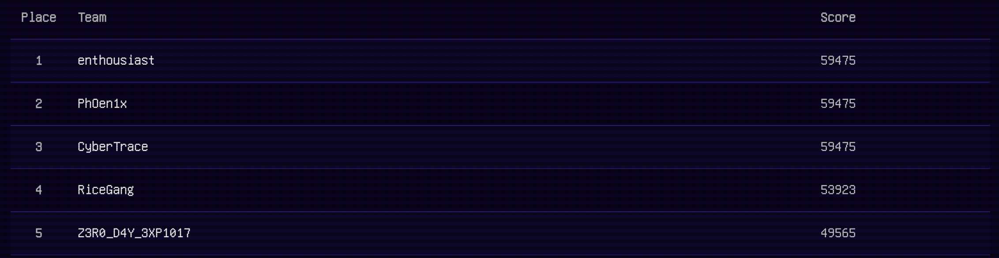
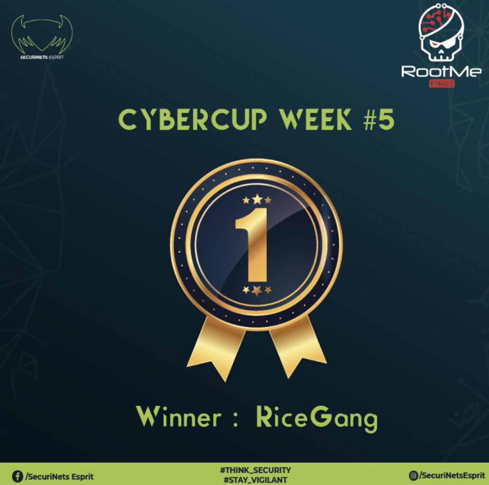
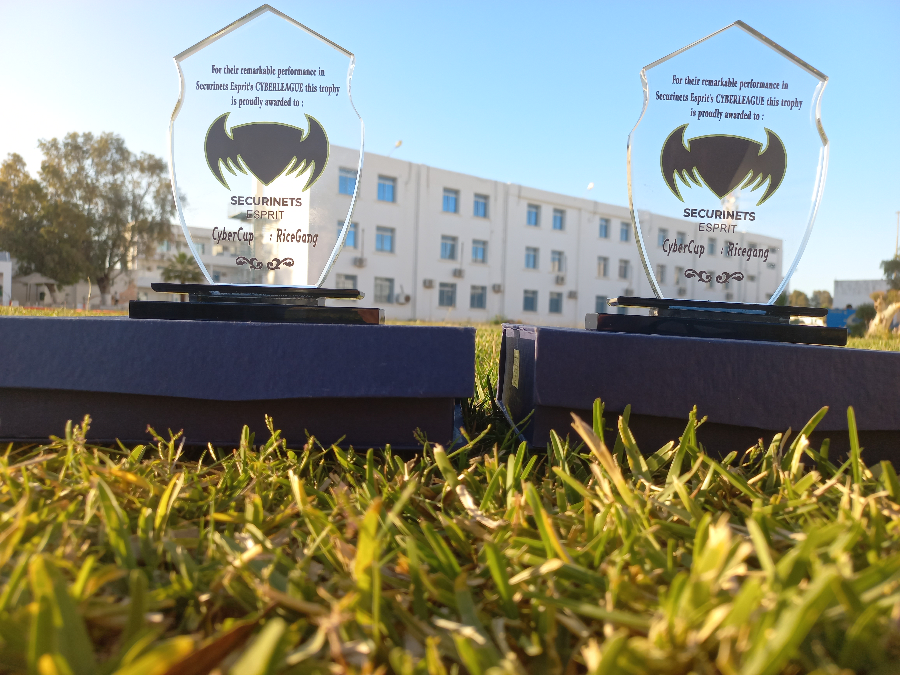

# Securinets Esprit Cyberleague 2022

<em>~ 22nd Jan ~ 22nd May ~</em>

A 3 month long Tunisian CyberLeague, that I played together with RiceGang, and we managed to get 4th place. I mainly did the crypto challenges and will be making writeups for them.

Each week they had a round of CyberCup (a 24 hour challenge / series of challenges) and I managed to win the Crypto Cybercup.

Here's a pic of the trophies, that my teammate sent me

