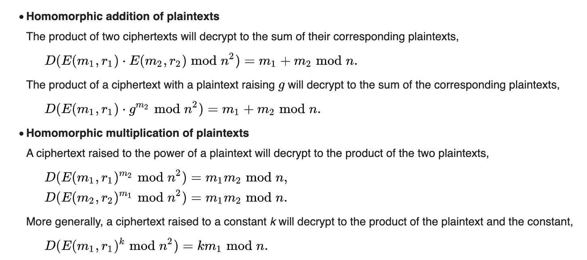
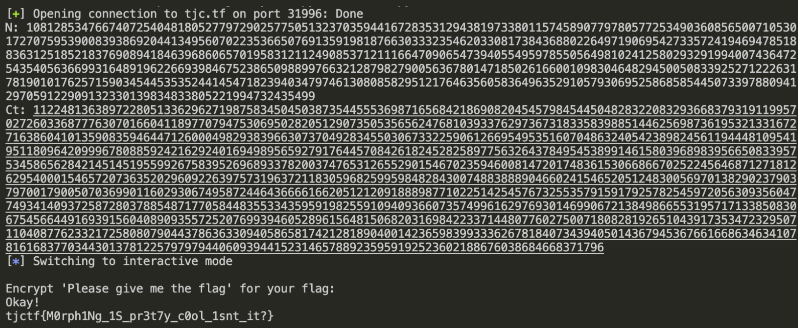

# TJCTF 2022 – Crypto Challenges

## Challenge 1: Factor Master

### Description/Source

```python
#!/usr/local/bin/python -u

from Crypto.Util.number import getPrime, isPrime, getRandomInteger
import sys, random

print("Are you truly the master here?")
print()
print("We'll have to find out...")
print()

def fail():
    print("You are not the master!")
    sys.exit(1)

def challenge1():
    p = getPrime(44)
    q = getPrime(1024)
    n = p * q
    return [p, q], n

def challenge2():
    p = getPrime(1024)
    q = p + getRandomInteger(524)
    if q % 2 == 0: q += 1
    while not isPrime(q): q += 2
    n = p * q
    return [p, q], n

def challenge3():
    small_primes = [n for n in range(2,10000) if isPrime(n)]
    def gen_smooth(N):
        r = 2
        while True:
            p = random.choice(small_primes)
            if (r * p).bit_length() > N:
                return r
            r *= p
    p = 1
    while not isPrime(p):
        p = gen_smooth(1024) + 1
    q = getPrime(1024)
    n = p * q
    return [p, q], n

challenges = [challenge1, challenge2, challenge3]
responses = ["Okay, not bad.", "Nice job.", "Wow."]

for i, chal in enumerate(challenges):
    print(f"CHALLENGE {i+1}")
    factors, n = chal()
    factors.sort()
    print(f"n = {n}")
    guess = input("factors = ? ")
    if guess != " ".join(map(str,factors)):
        fail()
    print(responses[i])
    print()

print("Here's your flag:")
with open("flag.txt") as f:
    print(f.read().strip())

```

We are given three factorization challenges

1. Factor when one of the primes are small (44 bit) --> factorDB or any other tool
2. Factor when both primes are close to each other --> fermat factorization
3. Factor when one of the primes `p` is smooth --> Pollard p-1 algorithm

### Solver

```python
from gmpy2 import sqrt, isqrt
#recognise that x and y are small in
# n = (root + x) * (root + y)
def fermat(n):
    a = isqrt(n)
    b2 = a*a - n
    b = isqrt(n)
    count = 0
    while b*b != b2:
        a = a + 1
        b2 = a*a - n
        b = isqrt(b2)
        count += 1
    p=a+b
    q=a-b
    assert n == p * q
    return p,q

# n is the prime, b is the upperbound of smooth primes to construct p-1
def pollard_P_1(n, b):
    n = mpz(n)
    a = mpz(2)  # needs to be coprime with n
    j = mpz(2)

    # mix in the X
    a = pow(a, n-1, n)

    # small factors
    for i in range(100):
        print('i: {}'.format(i))
        for _ in range(b//100):
            a = pow(a,j,n)
            j += 1

        p = gcd(a-1, n)
        if 1 < p < n:
            print('p = {}'.format(hex(int(p))))
            q = n//p
            assert p*q == n
            a = [p,q]
            a.sort()
            factors = str(a[0]) + " " + str(a[1])
            print(factors)

            return p
    return 0

```

### Flag

```
tjctf{S0_y0u_r34lly_c4n_F4c7t0r_4ny7th1nG_c36f63cfe73c}
```

## Challenge 2: Mac Master

Resources used

- [Hash Collisions](https://github.com/corkami/collisions)
- [MD5 Collision](https://www.mscs.dal.ca/~selinger/md5collision/)

### Description/Source

```python
#!/usr/local/bin/python -u
import hashlib
import os

with open("flag.txt") as f:
    FLAG = f.read()

QUERIED = set()
KEY = os.urandom(16)

print("Introducing Neil-MAC (NMAC), the future of hash-based message")
print("authentication codes!")
print()
print("No longer susceptible to those pesky length extension attacks!")
print()

def nmac(message):
    return hashlib.md5(message + KEY).hexdigest()

def query():
    print("What message would you like to query a tag for?")
    print("Enter message hex-encoded:")
    hex_message = input()
    message = bytes.fromhex(hex_message)
    QUERIED.add(message)
    print("Tag:", nmac(message))

def challenge():
    print("Challenge time!")
    print("Enter message hex-encoded:")
    hex_message = input()
    tag = input("Tag: ")
    message = bytes.fromhex(hex_message)
    if message in QUERIED:
        print("You already queried that message!")
    elif nmac(message) == tag:
        print("Nice job!")
        print("Flag:", FLAG)

while True:
    print("What do you want to do?")
    print("1) Query a message")
    print("2) Challenge")
    x = input()
    if x == "1":
        query()
    elif x =="2":
        challenge()
        break
    else:
        break
```

We are supposed to forge a MAC tag, and we are allowed to query the oracle for tags of messages but we cannot submit tags of what we have queried previously. The typical hash-extender libraries like `hashpumpy` wouldn't be too useful here as the KEY is the suffix instead of the prefix. However, we can abuse this property of MD5.

MD5 (and SHA1) operate in blocks of 64 bytes. If

```
hash(A) == hash(B)
hash(A+C) == hash(B+C)
```

So we just need to find two blocks which have the same hash (and are multiples of 64 bytes), and we can have a collision without needing to know the secret key. A sample MD5 collision, can be found on wikipedia

### Solver

```python
from pwn import *
host, port = "tjc.tf", 31415
p = remote(host, port)
p1 = b"d131dd02c5e6eec4693d9a0698aff95c2fcab58712467eab4004583eb8fb7f8955ad340609f4b30283e488832571415a085125e8f7cdc99fd91dbdf280373c5bd8823e3156348f5bae6dacd436c919c6dd53e2b487da03fd02396306d248cda0e99f33420f577ee8ce54b67080a80d1ec69821bcb6a8839396f9652b6ff72a70"
p2 = b"d131dd02c5e6eec4693d9a0698aff95c2fcab50712467eab4004583eb8fb7f8955ad340609f4b30283e4888325f1415a085125e8f7cdc99fd91dbd7280373c5bd8823e3156348f5bae6dacd436c919c6dd53e23487da03fd02396306d248cda0e99f33420f577ee8ce54b67080280d1ec69821bcb6a8839396f965ab6ff72a70"
p.sendlineafter(b'2) Challenge\n', b'1')
p.sendline(p1)
p.recvuntil(b'Tag: ')
tag = p.recvline().strip()
p.sendlineafter(b'2) Challenge\n', b'2')
p.sendline(p2)
p.sendline(tag)
p.interactive()
```

### Flag

```
tjctf{i_pr0baBly_sh0Uldnt_r0LL_my_0wn_M4CS}
```

## Challenge 3: Morph Master

Resources

- [Wikipedia](https://en.wikipedia.org/wiki/Paillier_cryptosystem)

### Description/Source

```python
#!/usr/local/bin/python -u

from Crypto.Util.number import *
from gmpy2 import invert

N = 1024
p = getPrime(N)
q = getPrime(N)
assert GCD(p * q, (p - 1) * (q - 1)) == 1

n = p * q
s = n ** 2
λ = (p - 1) * (q - 1) // GCD(p - 1, q - 1)
g = getRandomRange(1, s)
L = lambda x : (x - 1) // n
μ = int(invert(L(pow(g, λ, s)), n))

print("λ=",λ)
print("g=",g)

def encrypt(m):
    r = getRandomRange(1, n)
    c = (pow(g, m, s) * pow(r, n, s)) % (s)
    return c

def decrypt(c):
    m = (L(pow(c, λ, s)) * μ) % n
    return m

print(f"public key (n, g) = ({n}, ?)")
print(f"E(4) = {encrypt(4)}")
print()
print("Encrypt 'Please give me the flag' for your flag:")
c = int(input())
m = decrypt(c)

if long_to_bytes(m) == b"Please give me the flag":
    print("Okay!")
    with open("flag.txt") as f:
        print(f.read())
else:
    print("Hmm... not quite.")

```

This is the Pallier cryptosystem, which is additive homomorphic, which means that given the public key and `Encrypt(M1)` and `Encrypt(M2)`, we are able to derive `Encrypt(M1+M2)`.
Given an encryption of the number 4, we are supposed to forge an encryption of the text `Please give me the flag`.

Homomorphic addition can be extended to homomorphic multiplication (in terms of powers).



However, the integer representation of `Please give me the flag` is not fully divisible by 4, so the power to raise it to is not fully clear. However given that we are operating modulo `n`, we can use `(s2n('Please give me the flag') + k * n) % 4 == 0` to derive the multiple where `k` is any integer that makes the equation hold.

### Solver

```python
from libnum import n2s, s2n

from pwn import *
from gmpy2 import invert
def connect():
    host, port = "tjc.tf", 31996
    p = remote(host, port)

    p.recvuntil(b'public key (n, g) = (')
    line = p.recvline().decode()
    n = int(line.split(',')[0])
    print("N:", n)

    p.recvuntil(b'E(4) = ')
    ct = int(p.recvline().decode())
    print("Ct:", ct)
    n2 = n**2

    target = s2n(b"Please give me the flag")
    target += n*3
    assert target % 4 == 0

    multiple = target //4

    payload = pow(ct, multiple, n2)
    p.sendline(str(payload).encode())
    p.interactive()
connect()
```

### Flag



## Challenge 4: Complex Secrets

Resources:

- [Computing the Mobius transform given sufficient points](https://math.stackexchange.com/questions/3807648/deriving-a-m%C3%B6bius-transformation-specified-by-three-points)

### Description/Source

```python
from sage.geometry.hyperbolic_space.hyperbolic_isometry import moebius_transform

from Crypto.Util.number import long_to_bytes
from Crypto.Cipher import AES
from Crypto.Util.Padding import pad

CC = ComplexField(1000)
M = random_matrix(CC, 2, 2)
f = lambda z: moebius_transform(M, z)

for _ in range(3):
  z = CC.random_element()
  print(f'{z}, {f(z)}')

kz = CC.random_element()
print(kz)
kw = f(kz)

mod = 2^128
key = (kw.real() * mod).round() % mod
iv = (kw.imag() * mod).round() % mod

cipher = AES.new(long_to_bytes(key), AES.MODE_CBC, iv=long_to_bytes(iv))
flag = open('flag.txt', 'rb').read().strip()
print(cipher.encrypt(pad(flag, AES.block_size)).hex())

```

While this challenge may look quite intimidating, it is actually quite simple. A random 2 x 2 matrix is generated within the Complex Field (CC), of which all the values are unknown which is mapped using a Moebius Transform. The key objective is to derive what the Mobius transform function is. We are given 3 points that are generated by the function and asked to compute the transform of a 4th element.

Essentially the Mobius transform does this

```
Matrix = [[a,b],[c,d]]
Mobius_transform(z) = (az+b) /(cz+d)
```

This then comes down to solving linear equations. A good reference for this exact question is [here](https://math.stackexchange.com/questions/3807648/deriving-a-m%C3%B6bius-transformation-specified-by-three-points)

After that, it is trivial to derive the key and decrypt the flag.

### Solver

```python
z1,w1 = 0.751252475104902150054380260470082424940942078488589894835886382094520190155911685470371563701050697369544183678751477257366099792755542882738643885424403515309537713563954860359663092864297857722224211735174822128973163115308255633275717637048280034121430229730706501004373373606840613994093199272904 + 0.841861668516763747294345674363435037443728024638358025489205420413810104159006020506652639342846307992268857781065122156824070983948139347566280848043828162904529025108794173434070438994770903784077684729182119999999898429743502486564839408270440285915918786473949066441772595234741831309205651684568*I, 0.201820552659701567278699820457045288901739276475853715712764100364937770257073328213893265099577849805388343984823145356791212924649323204732529753602937115951408753746134803411134175204452068540445902455697100192364440968304237174405996380992768382752192891217816103133892621205190519839564725222336 - 0.423816958824499168732085508644057100988923673137297816050916269940199941289657589117016109479205180610293129190788130020334848589072754129840997885723883185873975039584829641029595055712803537604372394828956037589154549949135860267390135900885507020456790920944606711851387870845794071809212463826331*I
z2,w2 = 0.776514793014311984655381138131509469524119992819474341428630456463062790504804085732082006149990815536681444111523509785092822425698382654446410973046444281734605680914187333689998896693689515515572759566347286867634521643581373917824881234446339954362247273943593098930150187397950843860306622863580 - 0.475941057343914186895589101614692640391909664493116855595391636931715883641297227266824525033304512086494648741752634404427477616507082658573651384315523503299684846939359967818427022483531221272993316410991540493338441862300216790766719914758162337707917622972274977542891277169823499536763125709585*I, -0.0829824818323282231623134481057668754985546957232604522537959371649871583122429186730368826584813431855656529072360381066022438542967328924620815379076055266869158774334279817117785958274749511064133235090193481885185609994694126394591206558758685625397685334044491178052667228923075424247180695156733 - 0.345968105333553918003350791800133871917169258067196813155704860190219573649329520234046050433552655043308191278482739184238585083866790899409442542622314116242407901893394617331646886924568686923321775812031833527308561174363131001702994010093133515271661218024100064870678806860802831198736170237818*I
z3,w3 = -0.663391286734319736221346827623975650876654174129163479999853756391523203053535380294499772727456329988663661017976540801565872590854885766890888718844237565749376595356449959916640884087636566696028558587824118362193073284962397122081289899459328925814593804377359288230153455767585281669116316313838 - 0.541972552032528264213207333690290306273643909443286376166758545232778816979109002956992498760686744632107620506460722001053633042992521936775229761220922161685536981820475802554464255845679826910500220248396022338451861954865035006422732330447426553673873063666046382284940947655478871891111612590363*I, -0.581553240882262142181162436851132289784778023925017966570121189620721985017340981461901293038675551540555862372770197898969554728546495567114247578757093239302052370860105596035152108951138049420348497070193324989773752109127977897835841630760517346911518784515371336885087578772556126040706025016486 - 0.148891000802543728193673210236342762919468936522408931382020735274855877447158050594952372999611361659214905876927902350126036191702513383200942854542901034359507175169802518275202909250334785751232390353915118390153035895526806899854120766226305502441103032328925290052995543903563706593391160092495*I
z = -0.0968534235652319724025450700698245234813539980041800600675421557470079496692551704865634640081720474347208421764841452873771406009576502860884618489512416419757653899190683903143407896055069135527721841815213047414891185198812567191127563886853563460067525848162939956023227470365024430670027432479732 + 0.719846481319096444790392680396336625594155249590319099592967249434838543457064356759442590295332754722430981682955876722774704123394791814708454569343858536944427455385194480750097647064579948613218733596833670889225422205686067565808161860977900582097779526341740619742016067509756290527564777944900*I
A = (w1-w2)*(z-z2)*(z1-z3)
B = (w1-w3)*(z1-z2)*(z-z3)

kw = ((w3*A) - (w2*B)) / (A-B)

mod = 2^128
key = (kw.real() * mod).round() % mod
iv = (kw.imag() * mod).round() % mod

from Crypto.Cipher import AES
from libnum import n2s
cipher = AES.new(n2s(int(key)), AES.MODE_CBC, iv=n2s(int(iv)))
ct = bytes.fromhex("02c0142e94bdb20796edd08352ffe716a03afdffc2926c99e79620873a47f5149a67213d8c97b53fce16fb78f66c28cd")
print(cipher.decrypt(ct))

```

### Flag

```
#tjctf{ar3_y0u_a_c1rcl3_0r_a_l1n3?}
```

## Challenge 5: 7skcp

### Description/Source

```python
#!/usr/local/bin/python -u

from Crypto.Cipher import AES
from Crypto.Random import get_random_bytes
import random
from time import time

key = get_random_bytes(16)
flag = open('flag.txt', 'rb').read().strip()
# flag = b"tjctf{testing_1234567890abcdefghijklmnopqrs}"


def pad(msg, block_size):
    random.seed(seed)
    p = b''
    pad_len = block_size - (len(msg) % block_size)
    while len(p) < pad_len:
        b = bytes([random.randrange(256)])
        if b not in p:
            p += b
    return msg + p


def unpad(msg, block_size):
    random.seed(seed)
    p = b''
    while len(p) < block_size:
        b = bytes([random.randrange(256)])
        if b not in p:
            p += b

    if p[0] not in msg:
        raise ValueError('Bad padding')

    pad_start = msg.rindex(p[0])
    if msg[pad_start:] != p[:len(msg) - pad_start]:
        raise ValueError('Bad padding')

    return msg[:pad_start]


def encrypt(data):
    cipher = AES.new(key, AES.MODE_CBC)
    ct = cipher.encrypt(pad(data, AES.block_size))
    return cipher.iv + ct


def decrypt(data):
    iv = data[:AES.block_size]
    ct = data[AES.block_size:]
    cipher = AES.new(key, AES.MODE_CBC, iv=iv)
    # print("Decryptng:", iv,ct)
    return unpad(cipher.decrypt(ct), AES.block_size)


print('Hi! Welcome to our oracle, now extra secure because of our custom padding!')
seed = int(time() // 10)
print('We have this really cool secret here: ' + encrypt(flag).hex())


while True:
    try:
        decrypt(bytes.fromhex(input("Ciphertext: ")))
        print("ok")
    except:
        print("error!!!")
    print()
```

Basically, a classic padding oracle, except that instead of PKCS padding, we have custom padding which is generated by a random seed. This seed can be derived between the time of the first two messages you receive from the server

```python
print('Hi! Welcome to our oracle, now extra secure because of our custom padding!')
seed = int(time() // 10)
print('We have this really cool secret here: ' + encrypt(flag).hex())
```

The solver is a bit long so I'll just summarize the key ideas

1. Derive the array of pad bytes used
2. Guess the pad length of the last block is 1
3. Pad the bytes of the second to last block accordingly
   - If no solution is found, increase the padding
   - If a solution is found, the padding is correct
4. Once the correct character has been derived, increase the pad length, and edit the previous block to align all the pad characters again
5. Repeat until all the cipher text has been decrypted

Note: for steps 3, it is necessary to use range(256) as some of the pad characters may not be able to represented appropriately as ascii. For subsequent blocks, we can decrease the amount of requests to make by iterating through `string.printable` as the main cipher text should contain our main flag which should be in ASCII.

Basic knowledge of how CBC padding oracle works should be known first. The basics can be explored [here](https://research.nccgroup.com/2021/02/17/cryptopals-exploiting-cbc-padding-oracles/)

### Solver

```python
import random
import time
from tqdm import tqdm
import string
from pwn import *

t1 = int(time.time())

host,port = "tjc.tf", 31566
p = remote(host, port)
p.recvuntil(b'custom padding!')
seed = int(time.time() // 10)
print("Seed:", seed)
p.recvuntil(b'cool secret here: ')
ct = p.recvline().strip().decode()


print(f"ct={ct}")
print("length:", len(ct))

def checkIfPaddingWrong(payload):
    p.sendlineafter(b"Ciphertext: ", payload.encode('utf-8'))
    msg = p.recvline().strip().decode('utf-8')
    if msg == 'ok': return False
    elif msg == 'error!!!': return True
    else:
        print("something went wrong", msg)

random.seed(seed)
pad = b''.join([bytes([random.randrange(256)]) for _ in range(16)])

ct_blocks = [ct[i:i+32] for i in range(0,len(ct),32)]

def findChar(firstBlock, secondBlock, padding):
    firstBlock = [int(firstBlock[i:i+2], 16) for i in range(0,len(firstBlock), 2)]
    test1 = firstBlock[:]
    for i in range(padding):
        test1[-i-1] ^= (pad[padding-i-1] ^ pad[padding-i])

    flag = ""
    while padding < 16:
        found = False
        print("Curr  padding:", padding)

        # for i in tqdm(range(256)): #only use when trying to find out the length
        for i in tqdm(list(string.printable)): #when reducing the brute force range
            i = ord(i)
            testBlock = test1[:]
            testBlock[-padding-1] ^= (i ^ pad[0])

            payloadBlock = [bytes([j]) for j in testBlock]
            payloadBlock = (b"".join(payloadBlock)).hex()
            # print("Trying:", i,"with padding:", padding)
            if not checkIfPaddingWrong(payloadBlock+secondBlock):
                found = True
                flag = chr(i) + flag
                print("flag:", flag)
                padding += 1

                test1 = testBlock
                if padding == 16: return flag
                for j in range(padding):
                    test1[-j-1] ^= (pad[padding-j-1] ^ pad[padding-j])
                break
        if found == False:
            print("hello")
            raise Exception('I know Python!')

            break
    return flag

full_flag = ""
def getLength():
    global full_flag
    current_iv = ct_blocks[-2]
    current_block = ct_blocks[-1]
    padding = 1
    while True:
        try:
            flag_part = findChar(current_iv, current_block, padding)
            print("Got part:",flag_part)
            print("First padding:", padding)
            full_flag += flag_part
            break
        except:
            print("Upping padding to:", padding)
            padding += 1


def restOfFlag():
    global full_flag
    for i in range(2,len(ct_blocks)):
        current_iv = ct_blocks[-1 * i -1]
        current_block = ct_blocks[-1 * i]
        padding = 0

        flag_part = findChar(current_iv, current_block, padding)
        print("Got part:",flag_part)
        full_flag = flag_part + full_flag
        print("Current:", full_flag)
getLength()
restOfFlag()


print()
print("Full flag:", full_flag)
t2 = int(time.time())
print("Took:", t2-t1, "seconds")
```

### Flag

```
tjctf{r4nd0m_p4d51Ng_7b24051b}
```

## Challenge 6: Copper Master

### Description/Source

```python
#!/usr/local/bin/python -u

from Crypto.Util.number import *
import os

N = 768
e = 3

p = 1
while GCD(e, p - 1) != 1:
    p = getPrime(N)

q = 1
while GCD(e, q - 1) != 1:
    q = getPrime(N)

n = p * q
d = pow(e, -1, (p - 1) * (q - 1))


def pad(m, n_bits):
    # otherwise recovering the message will be a bit of a pain...
    assert m.bit_length() <= 500

    return (0b111101010110111 << (n_bits - 15)) + \
           ((m ** 2) << 500) + \
           m

def unpad(m_padded):
    return m_padded & ((1 << 500) - 1)

def encrypt(m):
    m = pad(m, 1400)
    c = pow(m, e, n)
    return c

def decrypt(c):
    m = pow(c, d, n)
    m = unpad(m)
    return m

m = int.from_bytes(os.urandom(25), "big")
c = encrypt(m)
print(f"public key (n, e) = ({n}, {e})")
print(f"c = {c}")
print(f"ans = ", m)
guess = int(input("m = ? "))
if guess == m:
    print("Wow! How did you do that?")
    with open("flag.txt") as f:
        print(f.read())
else:
    print("Nice try, but I know my padding is secure!")

```

We are basically given the encryption of a random message of 25 bytes, and asked to derive the original message. Given that the public exponent is low, the message is small, and the modulus is large, this opens up to some of Coppersmith attacks.

We can construct an equation of how the encryption works

```
pad = ((0b111101010110111 << (n_bits - 15)))
Encrypt(m) = (pad + x^2 * 2^500 + x) ^ e % n
```

Essentially, `Encrypt(m) - c ` has `x` as a small root of the solution, so we can use Coppersmith.

I got a bit tripped up over here because even though we have 1400 bits of modulus, a degree 6 polynomial, and a 200 bit unknown (which should be sufficient to find the roots because `6 * 200 < 1400`), each time I ran the code, it could not derive a solution. However turns out, I just needed a bigger lattice to find the solution rather than using the default values of epsilon in sage's internal implementation of coppersmith. Epsilon defaults to Beta / 8 , of which Beta defaults to 1 ( as a factor of N) as seen [here](https://doc.sagemath.org/html/en/reference/polynomial_rings/sage/rings/polynomial/polynomial_modn_dense_ntl.html) so in order to get a bigger lattice, we need to decrease the epsilon in order to increase size of lattice (at the cost of increased time). After some experimenting, `0.03` was a value that could successfully find the solution and didn't take too long.

Note:

- In order for `small_roots` to work, the polynomial you have needs to be monic (the coefficient of the largest power has to be 1)
- I didn't know sage had such a function and initially went to calculate the inverse and multiply everything by it lol

### Solver

```python
from pwn import *

host, port = "tjc.tf", 31657

import os

def solve(n,c, epsilon):
    e = 3
    n_bits = 1400
    pad = ((0b111101010110111 << (n_bits - 15)))
    ZmodN = Zmod(n)
    P.<x> = PolynomialRing(ZmodN, implementation='NTL')
    coeff = 2^500
    # pol = ((pad + x^2 * coeff + x)^e  - c) * (inverse_mod(coeff,n)^e)
    pol = ((pad + x^2 * coeff + x)^e  - c)
    pol = pol.monic()
    return pol.small_roots(X=2<<200, epsilon=epsilon) #decrease to 0.03 for a nice big lattice to solve

```

### Flag

```
tjctf{I_gu3ss_CusT0m_p4dd1ngs_b4d_2}
```
