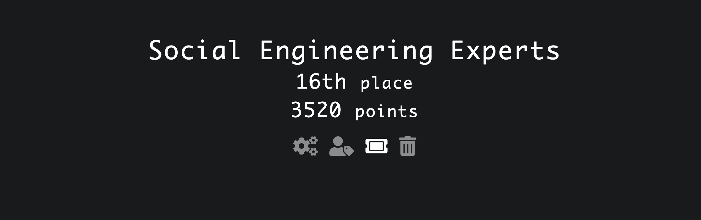

# UIUCTF 2022

<em>July 30 - Aug 1</em>

Pretty challenging CTF, but enjoyable challenges. Only solved a few by myself, but the rest of my team were great

| Challenge                      | Writeup Link                            | Tag                           |
| ------------------------------ | --------------------------------------- | ----------------------------- |
| Crypto - thatcrete-log         | [here](./thatcrete-log.md)              | DLP, Pseudoprimes             |
| Crypto - Wringing Rings        | [here](./Wringing%20Rings.md)           | CVP, LLL, SSSS                |
| Crypto - Elliptic Clock Crypto | [here](./Elliptic%20Clock%20Crypto.md)  | Isomorphism, ECC              |
| Jail - horse with no neighs    | [here](./Horse%20with%20no%20neighs.md) | Pyjail, unicode normalization |

### Challenge Repository

- https://github.com/sigpwny/UIUCTF-2022-Public
