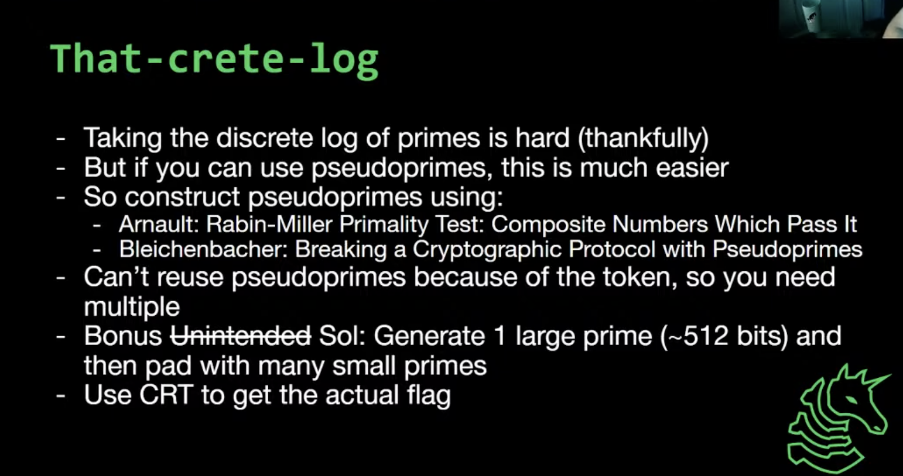

## Crypto Challenge: That-crete log

Note: I couldn't solve it during the ctf, but tried to make a writeup to help myself understand, heavily referenced from https://imp.ress.me/blog/2022-08-01/uiuctf-2022/#that-crete-log

### Description/Source

```py
from Crypto.Util.number import bytes_to_long
from random import randrange
from secret import FLAG
from signal import alarm

def miller_rabin(bases, n):
    if n == 2 or n == 3:
        return True

    r, s = 0, n - 1
    while s % 2 == 0:
        r += 1
        s //= 2

    for b in bases:
        x = pow(b, s, n)
        if x == 1 or x == n-1:
            continue
        for _ in range(r - 1):
            x = x * x % n
            if x == n-1:
                break
        else:
            return False
    return True

def is_prime(n):
    bases = [2, 3, 5, 7, 11, 13, 17, 19, 31337]
    for i in range(2,min(256, n)):
        if n%i == 0:
            return False
    if n < 256:
        return True
    return miller_rabin(bases, n)

LLIM = 2**512
ULIM = 2**1024

def die(msg):
    print("[X] " + msg)
    quit()

def verify_n_is_safe_prime(factors):
    N = 1
    for p in factors:
        N *= p
        if not is_prime(p):
            die("This factor is not prime!")
    N += 1

    if max(factors) < LLIM:
        die("Smooth N is not safe.")
    if not is_prime(N):
        die("This N is not prime!")
    if LLIM > N or N > ULIM:
        die("This N is out of range.")
    return N


def main():
    msg = bytes_to_long(FLAG)
    token = randrange(ULIM)
    msg ^= token
    print(f"[$] Here's your token for the session: {token}")
    alarm(60)

    blacklist = []
    for _ in range(5):
        user_input = input("[?] Give me the prime factors of phi(N): ").strip().split(' ')
        phi_factors = [int(x) for x in user_input]
        N = verify_n_is_safe_prime(phi_factors)
        if N in blacklist:
            die("No reusing N allowed!")
        x = randrange(N)
        print(f"[$] {x = }")
        out = pow(x, msg, N)
        print(f"[$] {out = }")
        blacklist.append(N)


if __name__ == '__main__':
    main()

```

There is a miller rabin primality check, which is a beefier version of Fermat's primality check. There are a certain fixed bases chosen.

One way to solve is to generate pseudo primes that you know the factorisation of (TBD), but the other is to generate prime numbers that are p-1 smooth for all the factors minus the 512 bit prime, then use the results from the 5 attempts to reconstruct using CRT.

We can eliminate the large prime from the DLP problem by raising it to the power of the large prime factor

```py
dlog = discrete_log(F(outs[i]) ^ large, F(xs[i]) ^ large)
sub_ord = (F(xs[i]) ^ large).multiplicative_order()
```

### Solver

```python


from Crypto.Util.number import *
from functools import reduce
from operator import mul
from pwn import *
# nc log.chal.uiuc.tf 1337
def subgroup_prime(large_factor_bits, small_factor_bits, last_factor_bit):
    while True:
        large_factor = getPrime(large_factor_bits)
        small_factors = [getPrime(i) for i in small_factor_bits]
        factors = small_factors + [large_factor, 2]

        for _ in range(100):
            last_factor = getPrime(last_factor_bit)
            p = reduce(mul, factors) * last_factor +1
            if isPrime(p):
                factors += [last_factor]
                factors.sort()
                return p, factors

ps, facs = [], []
for _ in range(5):
    p,fac = subgroup_prime(513, [20]*10, 20)
    ps.append(p)
    facs.append(fac)


p = remote("log.chal.uiuc.tf", 1337)
p.recvuntil(b"[$] Here's your token for the session: ")
token = int(p.recvline().strip().decode('utf-8'))
xs = []
outs = []
for i in range(5):
    s = ' '.join(list(map(str,facs[i])))
    p.sendlineafter(b'[?] Give me the prime factors of phi(N):', s.encode())
    p.recvuntil(b'[$] x = ')
    x = int(p.recvline().strip().decode('utf-8'))
    p.recvuntil(b'[$] out = ')
    out = int(p.recvline().strip().decode('utf-8'))

    xs.append(x)
    outs.append(out)

p.close()


# sage code,
residues, mods = [], []
for i in range(5):
    F = Zmod(ps[i])
    large = facs[i][-1]

    # a^x = b, x = discrete_log(b,a)
    dlog = discrete_log(F(outs[i]) ^ large, F(xs[i]) ^ large)
    sub_ord = (F(xs[i]) ^ large).multiplicative_order()
    residues.append(dlog)
    mods.append(sub_ord)

flag = crt(residues, mods) ^^ token
from libnum import n2s
print(n2s(int(flag)))

```

### Flag

```
uiuctf{w0w_1_th0ughT_Th4t_discr3te_L0g_w4s_h4rD_f04_s4f3_prim2s!1!_d91ea3cf4a3daaf0604520}
```

### Notes

- https://link.springer.com/content/pdf/10.1007%2F978-3-540-30580-4_2.pdf
- [Primes and Prejudice](https://eprint.iacr.org/2018/749.pdf)
- https://giacomopope.com/redpwn/#jeopardy
- [Constructing Carmichael numbers that are strong primes to Several bases](https://core.ac.uk/download/pdf/81930829.pdf)
- https://projecteuclid.org/download/pdf_1/euclid.bams/1183501763
- [Section 4.2, Constructing Elliptic Curves of Prescribed Order](https://scholarlypublications.universiteitleiden.nl/access/item%3A2895327/view)
- [Implementation of Above 4.2 Algorithm by Chicubed](https://gist.github.com/ChiCubed/0977601c9ce88eda03b9d2576231192e)
- Author's Solution
  

> Many thanks to @4yn and @vishiwoz for helping me understand their solutions
