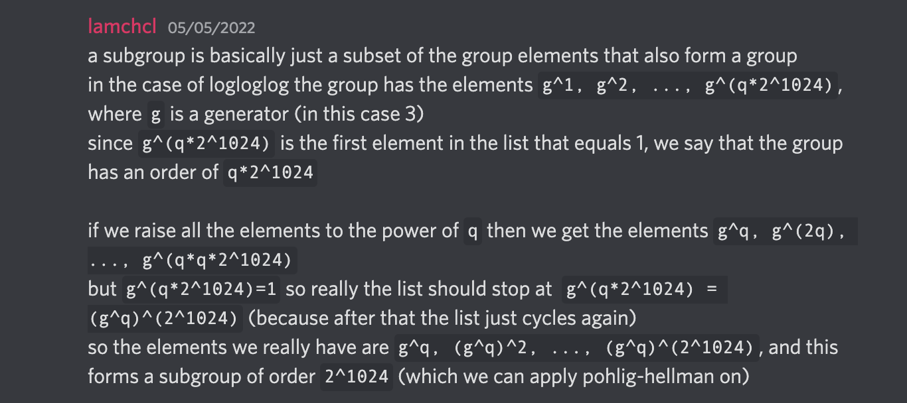

# Angstrom 2022 – Crypto Challenges

Note: These writeups are all solved post-CTF and relying on the solutions of people much more intelligent than I am.

The official writeups are [here](https://hackmd.io/@lamchcl/rJgPUtgI5)

## Crypto Challenge: log log log

Note: referenced off `lamchcl`'s comments in discord



### Description/Source

```python
from secrets import randbits
from flag import flag

flagbits = len(flag) * 8
flag = int(flag.hex(),16)

q = 127049168626532606399765615739991416718436721363030018955400489736067198869364016429387992001701094584958296787947271511542470576257229386752951962268029916809492721741399393261711747273503204896435780180020997260870445775304515469411553711610157730254858210474308834307348659449375607755507371266459204680043
p = q * 2^1024 + 1

assert p in Primes()

nbits = p.nbits()-1

e = randbits(nbits-flagbits)
e <<= flagbits
e |= flag

K = GF(p)
g = K.multiplicative_generator()
a = g^e

print(hex(p))
print(g)
print(hex(a))
print(flagbits)


"""
0xb4ec8caf1c16a20c421f4f78f3c10be621bc3f9b2401b1ecd6a6b536c9df70bdbf024d4d4b236cbfcb202b702c511aded6141d98202524709a75a13e02f17f2143cd01f2867ca1c4b9744a59d9e7acd0280deb5c256250fb849d96e1e294ad3cf787a08c782ec52594ef5fcf133cd15488521bfaedf485f37990f5bd95d5796b0000000000000000000000000000000000000000000000000000000000000000000000000000000000000000000000000000000000000000000000000000000000000000000000000000000000000000000000000000000000000000000000000000000000000000000000000000000000000000000000000000000000000001
3
0xaf99914e5fb222c655367eeae3965f67d8c8b3a0b3c76c56983dd40d5ec45f5bcde78f7a817dce9e49bdbb361e96177f95e5de65a4aa9fd7eafec1142ff2a58cab5a755b23da8aede2d5f77a60eff7fb26aec32a9b6adec4fe4d5e70204897947eb441cc883e4f83141a531026e8a1eb76ee4bff40a8596106306fdd8ffec9d03a9a54eb3905645b12500daeabdb4e44adcfcecc5532348c47c41e9a27b65e71f8bc7cbdabf25cd0f11836696f8137cd98088bd244c56cdc2917efbd1ac9b6664f0518c5e612d4acdb81265652296e4471d894a0bd415b5af74b9b75d358b922f6b088bc5e81d914ae27737b0ef8b6ac2c9ad8998bd02c1ed90200ad6fff4a37
880
"""
```

We are supposed to solve the discrete log problem where the order of the group is made up of a large prime (q) multiplied by 2^1024. The flag is also only 880 bits long and is padded by random bits up to `nbits` which is 2047.

`p` is a Proth prime which means that `p = k x 2^n + 1` where `k` is odd and `2^n > k`. (in this case `q` == `k`)

The dlog problem can be easily solved in the `2^1024` subgroup with Pohlig-Hellman since it is made out of small prime factors but it cannot work with `q`. However, because the flag is small (880 bits only) and makes out the least significant bits, we don't have to recover the rest of the information (the random bits) in the subgroup of `q`, which I'm guessing is due to the fact that `2^n > q`.

The current equation to solve is `g^e = a` where `e` contains the flag that we want to find. However if we disregard the additional random bits to solve within the smaller subgroup of 2^1024, eliminating `q` from the group, we can raise both sides to the power of 2^1024. Raising the equation to the power of 2^1024 leads to only 2^1024 possible answers (reducing it to that group).

### Solver

```python
from libnum import n2s
q = 127049168626532606399765615739991416718436721363030018955400489736067198869364016429387992001701094584958296787947271511542470576257229386752951962268029916809492721741399393261711747273503204896435780180020997260870445775304515469411553711610157730254858210474308834307348659449375607755507371266459204680043
p = 0xb4ec8caf1c16a20c421f4f78f3c10be621bc3f9b2401b1ecd6a6b536c9df70bdbf024d4d4b236cbfcb202b702c511aded6141d98202524709a75a13e02f17f2143cd01f2867ca1c4b9744a59d9e7acd0280deb5c256250fb849d96e1e294ad3cf787a08c782ec52594ef5fcf133cd15488521bfaedf485f37990f5bd95d5796b0000000000000000000000000000000000000000000000000000000000000000000000000000000000000000000000000000000000000000000000000000000000000000000000000000000000000000000000000000000000000000000000000000000000000000000000000000000000000000000000000000000000000001
a = 0xaf99914e5fb222c655367eeae3965f67d8c8b3a0b3c76c56983dd40d5ec45f5bcde78f7a817dce9e49bdbb361e96177f95e5de65a4aa9fd7eafec1142ff2a58cab5a755b23da8aede2d5f77a60eff7fb26aec32a9b6adec4fe4d5e70204897947eb441cc883e4f83141a531026e8a1eb76ee4bff40a8596106306fdd8ffec9d03a9a54eb3905645b12500daeabdb4e44adcfcecc5532348c47c41e9a27b65e71f8bc7cbdabf25cd0f11836696f8137cd98088bd244c56cdc2917efbd1ac9b6664f0518c5e612d4acdb81265652296e4471d894a0bd415b5af74b9b75d358b922f6b088bc5e81d914ae27737b0ef8b6ac2c9ad8998bd02c1ed90200ad6fff4a37
g = 3

# a = g^e
x = pow(2,1024)

order = p-1 # x * q

#raise to qth power to reduce problem to 2^1024 subgroup
new_g = pow(g,order//x, p)
new_a = pow(a,order//x,p)

#solving easier problem of new_g ^ flag = new_a within 2^1024 subgroup
#sage discrete_log internally implements pohlig hellman
flag = discrete_log(new_a, new_g%p)
print(n2s(int(flag)))

#"b\xd3\x9f\xe8\xcb\x8eV\xe8\x00\x05\n\xf6+=5\xb0c\xd2actf{it's log, it's log, it's big, it's heavy, it's wood, it's log, it's log, it's better than bad, it's good}"

```

### Flag

```
actf{it's log, it's log, it's big, it's heavy, it's wood, it's log, it's log, it's better than bad, it's good}
```

## Crypto Challenge: RSA-AES

### Description/Source

```python
from Crypto.Util.number import bytes_to_long, long_to_bytes
from Crypto.Util.Padding import pad
from Crypto.Random import get_random_bytes
from Crypto.Cipher import AES
from secret import flag, d

assert len(flag) < 256

n = 0xbb7bbd6bb62e0cbbc776f9ceb974eca6f3d30295d31caf456d9bec9b98822de3cb941d3a40a0fba531212f338e7677eb2e3ac05ff28629f248d0bc9f98950ce7e5e637c9764bb7f0b53c2532f3ce47ecbe1205172f8644f28f039cae6f127ccf1137ac88d77605782abe4560ae3473d9fb93886625a6caa7f3a5180836f460c98bbc60df911637fa3f52556fa12a376e3f5f87b5956b705e4e42a30ca38c79e7cd94c9b53a7b4344f2e9de06057da350f3cd9bd84f9af28e137e5190cbe90f046f74ce22f4cd747a1cc9812a1e057b97de39f664ab045700c40c9ce16cf1742d992c99e3537663ede6673f53fbb2f3c28679fb747ab9db9753e692ed353e3551
e = 0x10001
assert pow(2,e*d,n)==2

enc = pow(bytes_to_long(flag),e,n)
print(enc)

k = get_random_bytes(32)
iv = get_random_bytes(16)
cipher = AES.new(k, AES.MODE_CBC, iv)

while 1:
	try:
		i = int(input("Enter message to sign: "))
		assert(0 < i < n)
		print("signed message (encrypted with military-grade aes-256-cbc encryption):")
		print(cipher.encrypt(pad(long_to_bytes(pow(i,d,n)),16)))
	except:
		print("bad input, exiting")
```

We are given a mixture of RSA and AES, where we are given an oracle, that tells us the AES CBC encryption of the RSA decryption of our input. This is vulnerable to Manger's attack as depicted [here](https://research.kudelskisecurity.com/2018/04/05/breaking-rsa-oaep-with-mangers-attack/#bilbio) and this writeup is focused on trying to synthesize my understanding of the article.

A few variables to start with

```
n = modulus
e = public exponent
d = private exponent
k = log(n,256) --> ~ byte length of 256
```

Given access to the decryption oracle which can tell us if `y = c^d % n` and if `y < 2^(8k-8)`, we can narrow it down the possible encryptions of a particular message `c = m^e % n` in log(n) queries.

In this case, `B = 2^(8k-8)` and `2B < n`, which makes the interval to work with easier.

Overview of steps

1. Multiply unknown plaintext with increasing powers of 2, _f_, until `f * m >= B % n`. This ensures that `B < f * m < 2B` so we know that `B/2 < f*m/2 < B`
2. If oracle returns a value with length <= 256 (B), then the padding is correct, if length > 256 then padding is wrong
3. Now multiply the plaintext _m_ with `f2 = ((n+B)/B + j) * f/2` for _j_ in [1,n] until `f2 * m < B`. This will terminate and give `n< f2 * m < n + B`
4. Finally do a sort of binary search on all possible values of _m_

- The min for _m_ is `n/f2` and the max is `(n+B)/f2`
- While there is more than one value between the min and max
  - Choose a multiple _mul_ = `2B / (max - min)`
  - Choose a boundary point `i = (mul * min) / n`
  - Compute _f3_ = `i * n / min` and send to oracle
    - if _f3_ >= B, _min_ is now `(i*n + B) / f3`
    - else, _max_ is now `(i*n + B) / f3`

### Solver

```python
# from math import ceil
from libnum import n2s,s2n
from pwn import *

n = 0xbb7bbd6bb62e0cbbc776f9ceb974eca6f3d30295d31caf456d9bec9b98822de3cb941d3a40a0fba531212f338e7677eb2e3ac05ff28629f248d0bc9f98950ce7e5e637c9764bb7f0b53c2532f3ce47ecbe1205172f8644f28f039cae6f127ccf1137ac88d77605782abe4560ae3473d9fb93886625a6caa7f3a5180836f460c98bbc60df911637fa3f52556fa12a376e3f5f87b5956b705e4e42a30ca38c79e7cd94c9b53a7b4344f2e9de06057da350f3cd9bd84f9af28e137e5190cbe90f046f74ce22f4cd747a1cc9812a1e057b97de39f664ab045700c40c9ce16cf1742d992c99e3537663ede6673f53fbb2f3c28679fb747ab9db9753e692ed353e3551
e = 0x10001

host, port= "localhost", 8000
p = remote(host, port)
enc = int(p.recvline().decode())


k = n.bit_length()//8
B = 2**(8 * (k - 1))

def queryOracle(msg,):
    p.sendlineafter(b'Enter message to sign:', str(msg).encode())
    p.recvline()
    res = n2s(int(p.recvline().strip())) #edited to make it work locally
    return len(res) <= 256

# #step 1
f = 2 **1700 #technically should start from 2 but its a long process...
while queryOracle((pow(f,e,n)*enc) % n):
    print("f bit length:", f.bit_length())
    f <<= 1

print("got step 1: f = ", f)
#step 3
for j in range(1,n):
    f2 = (((n+B) //B) + j) * (f//2)
    if queryOracle((pow(f2,e, n) * enc) % n):
        break
print("got step 2: f2 = ", f2)

minimum = n // f2 + (n%f2 > 0)
maximum = (n+B) // f2
calls = 0

while maximum != minimum:
    calls += 1
    print("calls:", calls, "diff:", maximum - minimum)
    mul = (2*B) // (maximum - minimum)
    i = (mul * minimum) // n
    f3 = ((i * n) // minimum)
    if((i*n) % minimum == 0):
        f3 += 1

    new_bounds_1 = (i*n + B) // f3
    new_bounds_2 = new_bounds_1 + ((i*n+B) % f3 > 0)


    if queryOracle((pow(f3,e,n) * enc) % n):
        maximum = new_bounds_1
    else:
        minimum = new_bounds_2


print("got result:", maximum)
print(n2s(maximum))
```

### Flag

```
actf{the_letters_in_rsa_and_aes_form_aries_if_you_throw_in_the_letter_i_because_that_represents_yourself_or_something_anyway_aries_is_a_zodiac_sign_which_means_that_the_two_cryptosystems_are_mutually_compatble_i_think??}
```
