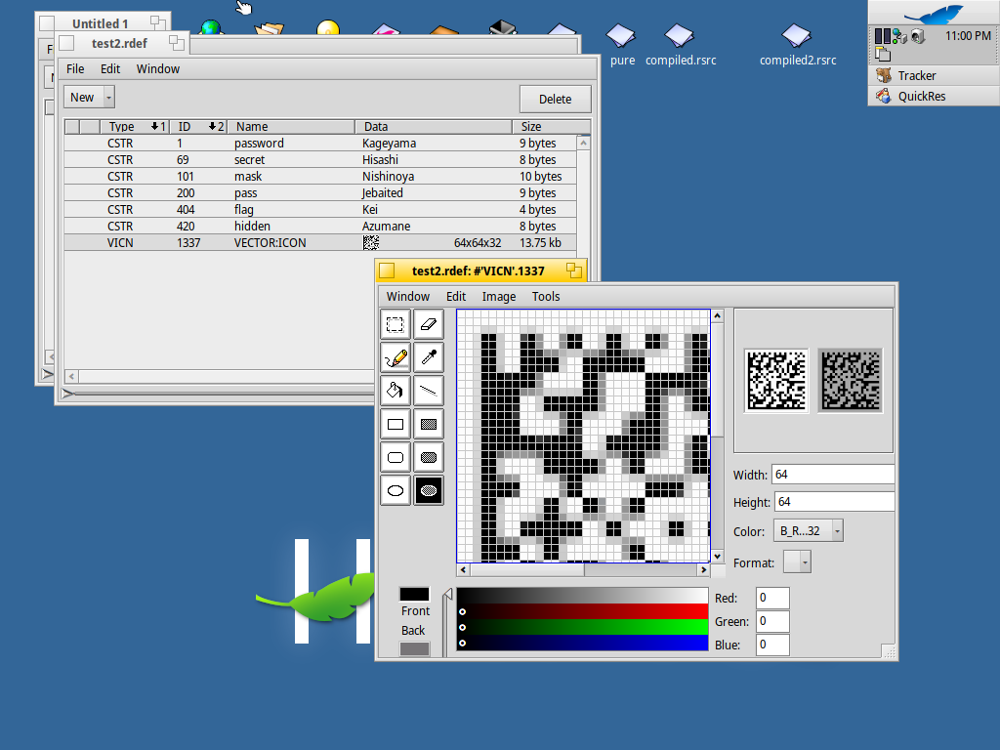
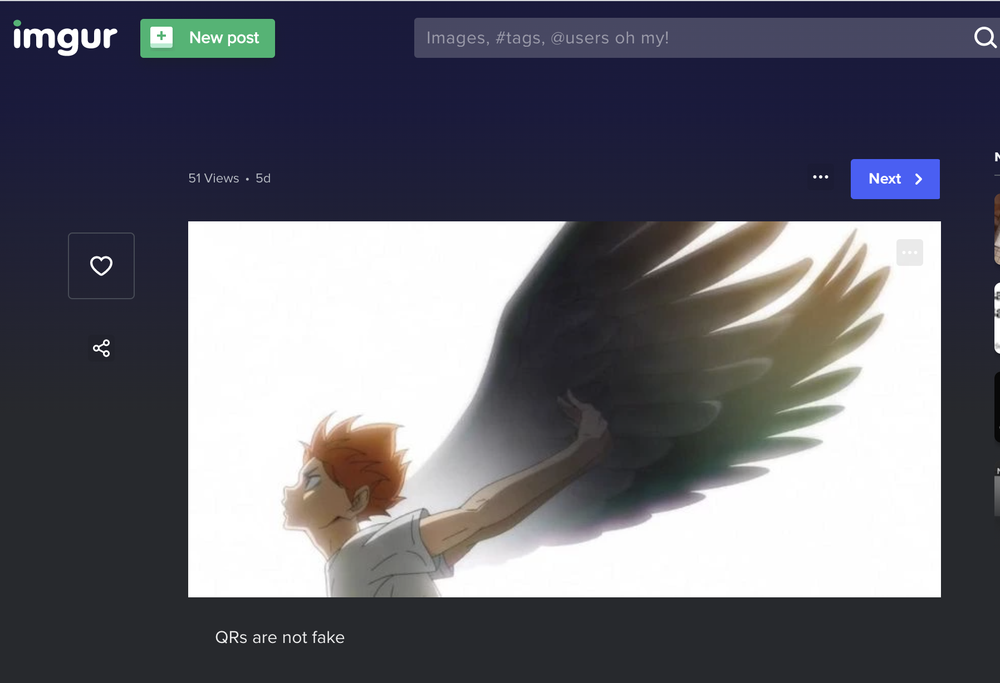

# CTF Name – backdoorCTF 2021

- **Category:** Misc
- **Points:** 436
- **No of correct submissions during the CTF:** 5

## Challenge

The challenge prompt was

```
Can you help Hinata to enter his dream high school by giving some tips? Tell him what to do after the Start and he might need some QuickRest along the way?
```

We are also given a .jpeg image called `Crows`.

## Solution

The challenge prompt contained quite a few hints, namely

- "after the Start"
- "need some QuickRest"
- and the challenge title "Haikyu"

Running a standard `strings` command on the jpeg image given showed that there was some interesting data at the end of the file.

```
3x1u5
tNPP"D
sFn|
Start
resource(1337,"Data") #'VICN' array {
$"6E6369660205FC0504310007C73CC95AC73CC95AC733C962C732C9D9C732C977"
[many similar lines...]
$"1112131415161718000A0118191A1B1C1D1E1F202122232425262728292A2B2C"
$"2D2E2F3000"
resource(69,"secret") "Hisashi";
resource(404,"flag") "Kei";
resource(420,"hidden") "Azumane";
resource(101,"mask") "Nishinoya";
resource(200,"pass") "Jebaited";
resource(01,"password") "Kageyama";
```

Searching the strange resource syntax led me to this [link](https://www.haiku-os.org/documents/dev/compile_them_resources/) telling about the need to compile resource files in HaikuOS, which sounded like what the challenge title was a reference to.

Copying all the strings after the "Start" string, and creating a `test.rdef` file using the content.

I downloaded the Haiku OS image from [here](https://www.haiku-os.org/get-haiku/r1beta3/). For some reason, the 64-bit version wasn't working so I just used the 32-bit version. The reason why the VM was needed because the compiler for such files was only present in that system.

However simply running commands to compile and bind the resource definitions seemed to yield gibberish.

```
rc -o compiled.rsrc test.rdef
touch output
xres -o output compiled.rsrc
```

However the other hint was the word `QuickRest`, and from this [lesson](https://www.haiku-os.org/files/learning_to_program/Learning_to_Program_With_Haiku_Lesson_19.pdf), I figured out that there were other applications that could compile the `.rdef` files like `QuickRes`.

Yet again I faced some trouble finding a place to download `QuickRes` but after finding Haiku's Package Manager, `Haiku Depot`, I managed to download it.

Opening the `.rdef` file in QuickRes showed a data matrix from the long strings in the resource array.


Scanning the data matrix yielded an imgur link of another photo.



Downloading this photo and conducting standard forensics procedures like using `stegsolve.jar`, `strings`, `binwalk`, `exiftool` etcetera, didn't yield anything useful.

However at the bottom of the first image, there were some strings mentioning passwords.

Popping the image [here](https://futureboy.us/stegano/decinput.html) with the correct password yielded the flag.

Because the challenge might be rehosted on `backdoor` (which btw has quite a large repository of a variety of challenges), I will only include the SHA-512 of the resultant flag.

```
Flag: da2d809c1deee8bb4c27a05ac5f5d6438710e7a9cccf013b92e4efcabf2d9642038aeb13d23fcf2638750a4c291b29dcd4703f9c96cf7e2d0b0a0a6d52135f23
```

## Thoughts

- A really cool challenge which has quite a lot of corners and turns that I didn't expect
- Enjoyed the challenge and the chance to get introduced to a new OS and their interesting file types.
