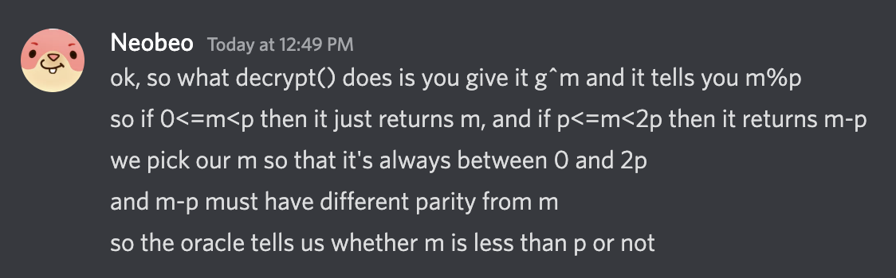

## Crypto Challenge: generous

### Description/Source

```python
#!/usr/local/bin/python
from Crypto.Util.number import getPrime, inverse, bytes_to_long
from random import randrange

with open("flag.txt", "rb") as f:
	flag = f.read().strip()

def gen_keypair():
	p, q = getPrime(512), getPrime(512)
	n = (p**2) * q
	while True:
		g = randrange(2, n)
		if pow(g, p-1, p**2) != 1:
            return g
			break
	h = pow(g, n, n)
	return (n, g, h), (g, p, q)

def encrypt(pubkey, m):
	n, g, h = pubkey
	r = randrange(1, n)
	c = pow(g, m, n) * pow(h, r, n) % n
	return c

def decrypt(privkey, c):
	g, p, q = privkey
	a = (pow(c, p-1, p**2) - 1) // p
	b = (pow(g, p-1, p**2) - 1) // p
	m = a * inverse(b, p) % p
	return m

def oracle(privkey, c):
	m = decrypt(privkey, c)
	return m % 2

pub, priv = gen_keypair()
n, g, h = pub
print(f"Public Key:\n{n = }\n{g = }\n{h = }")
print(f"Encrypted Flag: {encrypt(pub, bytes_to_long(flag))}")
while True:
	inp = int(input("Enter ciphertext> "))
	print(f"Oracle result: {oracle(priv, inp)}")

```

We are given an Okamoto Uchiyama Cryptosystem that has some interesting properties, a homomorphism and the ability to modify the ciphertext without changing the decryption result even without knowing the secret key

```py
# E(m1) * E(m2) = E(m3)
x1 = encrypt(1)
x2 = encrypt(2)
assert decrypt(x1*x2) == 3

# c * h^x = c
test_num = random.randrange(1,n)
x3 = encrypt(3)
x3_ = (x3 * pow(h,test_num, n)) % n
assert decrypt(x3) == decrypt(x3_) == 3
```

These properties are only relevant in Solution 1

### Solution 1

We can use additive homomorphic property, as well as the fact that we can multiply the ciphertext by raising it to the power. To do division we can raise it to the power of the `inverse mod n`, and in so doing, simulate a right shift and recover the flag bit by bit.

$$
E(x) \cdot E(-1) = E(x-1)\\
E(2x) = E(x)^{2}
$$

So first we check the LSB, if it is 0, that means that the current number is even and no information will be lost with the right shift, but if it is 1, we have to use the first property to subtract the 1 to make it even. So we recover the flag bits from LSB to MSB

Given we know the starting of the flag, we can use this to figure out when to stop.

#### Solver

```py
from libnum import *
from pwn import *
from random import randrange

host, port = 'be.ax', 31244

def encrypt(pub,m):
    n,g,h = pub
    r = randrange(1, n)
    c = pow(g, m, n) * pow(h, r, n) % n
    return c

def oracle(x):
	p.sendlineafter(b'Enter ciphertext> ', str(x).encode())
	p.recvuntil(b'Oracle result: ')
	out = int(p.recvline().strip().decode('utf-8'))
	return out

p = remote(host, port)
p.recvline()
n = eval(p.recvline().decode('utf-8').split('= ')[-1])
g = eval(p.recvline().decode('utf-8').split('= ')[-1])
h = eval(p.recvline().decode('utf-8').split('= ')[-1])
p.recvuntil(b'Encrypted Flag: ')
pub = (n,g,h)

c = eval(p.recvline().decode('utf-8'))
print("Got n,g,h, c")

def reconstructBits():
    target = bin(s2n(b'corctf'))[2:]
    flag_bits = ''
    curr_ct = c

    divide_2 = pow(2,-1,n)

    while not flag_bits.startswith(target):
        print(f"at {len(flag_bits)} bits")
        if oracle(curr_ct) == 1:
            flag_bits = '1' + flag_bits
            # because the flag is odd here, i need -1 from cipher text before dividing
            curr_ct *= encrypt(pub, -1)
        else:
            flag_bits = '0' + flag_bits

        # right shift the current cipher text
        curr_ct = pow(curr_ct, divide_2, n)

    print(n2s(int(flag_bits,2)))

reconstructBits()
```

### Solution 2

We can use the LSB oracle to do binary search on the prime because of the result

```py

def decrypt(privkey, c):
	g, p, q = privkey
	a = (pow(c, p-1, p**2) - 1) // p
	b = (pow(g, p-1, p**2) - 1) // p
	m = a * inverse(b, p) % p
	return m

def oracle(privkey, c):
	m = decrypt(privkey, c)
	return m % 2
```

If we provide

$$
\begin{gather}
c = g^p\\
a = ((c^{p\cdot (p-1)}\bmod p^2) -1) // p = 0
\end{gather}
$$

$$
\begin{aligned}
\text{Encrypt}(m) = g^mh^r \bmod n, & \text{ where } 0 \leq r \leq n\\
\text{Decrypt}(g^m) = m \bmod p, & \text{ where } r = 0 \\
\end{aligned}
$$

So that means we can use the oracle to do binary search on the bits of $p$

$$
\begin{aligned}

\text{Oracle}(g^m) = \text{Decrypt}(g^m) \bmod 2 \\\\

\text{Decrypt}(g^m) \bmod 2=
\begin{cases}
m \bmod 2, & \text{ if } 0 \leq m\lt p\\
(m-p) \bmod 2, & \text{ if } p \leq m\lt 2p\\
\end{cases}
\end{aligned}
$$

Since $p$ is odd, we can set $m$ to be even and between 0 and $2p$, so the parity will be flipped based on the 2 different cases

- If $\text{Oracle}(g^m) = 0$, then $m \lt p$
- If $\text{Oracle}(g^m) = 1$, then $m \gt p$

$$
\text{oracle}(g^x)=
\begin{cases}
1, & \text{if } x\geq p\\
0, & \text{otherwise}
\end{cases}
$$

#### Solver

```py
from pwn import *
from libnum import *
from Crypto.Util.number import getPrime, inverse, bytes_to_long
from random import randrange
# nc be.ax 31244
host, port = 'be.ax', 31244


def oracle(x):
	p.sendlineafter(b'Enter ciphertext> ', str(x).encode())
	p.recvuntil(b'Oracle result: ')
	out = int(p.recvline().strip().decode('utf-8'))
	return out

p = remote(host, port)
p.recvline()
n = eval(p.recvline().decode('utf-8').split('= ')[-1])
g = eval(p.recvline().decode('utf-8').split('= ')[-1])
h = eval(p.recvline().decode('utf-8').split('= ')[-1])
p.recvuntil(b'Encrypted Flag: ')

c = eval(p.recvline().decode('utf-8'))
print("Got n,g,h, c")
test_p = 1 << 511
from tqdm import trange
for shift in trange(510,-1,-1):
    x = 1 << shift
    if oracle(pow(g,test_p+x,n)) == 0:
        test_p += x

assert  n % (test_p**2) == 0
q = n // (test_p**2)

a = (pow(c, test_p-1, test_p**2) - 1) // test_p
b = (pow(g, test_p-1, test_p**2) - 1) // test_p
m = a * pow(b,-1, test_p) % test_p
print(n2s(m))


```

### Flag

```
corctf{see?1_bit_is_very_generous_of_me}
```

### Notes

- Okamoto Uchiyama Cryptosystem is very cool
- [Github](https://github.com/maojui/Cytro/blob/master/cytro/asym/cryptosystem.py) for bunch of cryptosystem implementations including this one
- https://remyoudompheng.github.io/ctf/corctf2022/generous.html
- https://jsur.in/posts/2022-08-08-corctf-2022-crypto-writeups/#generous
- Many thanks to @Neobeo for helping me understand Solution 2
  
