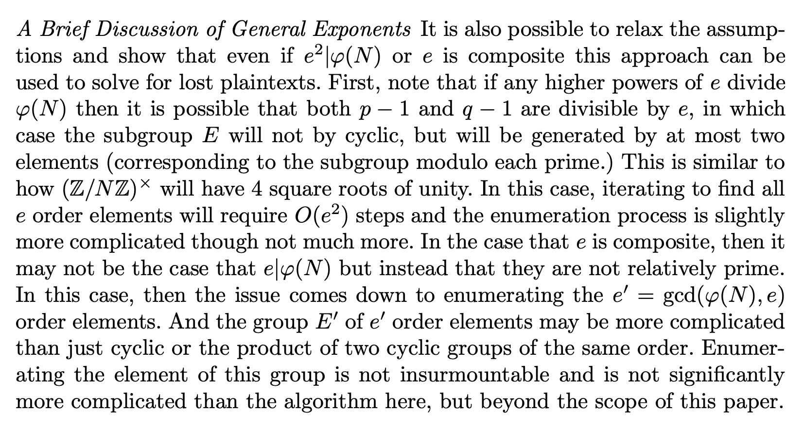

# DiceCTF Name – BabyRSA

- **Category:** Cryptography

## Disclaimer

I did not manage to solve this problem on my own. It was a teammate that solved it and this problem was quite interesting that I decided to try and make a writeup out of it.

## Challenge

We are given a `data.txt` which gives the variables of the modulus, exponent and cipher.

```
N = 57996511214023134147551927572747727074259762800050285360155793732008227782157
e = 17
cipher = 19441066986971115501070184268860318480501957407683654861466353590162062492971
```

A `generate.py` is also given. The difficult part of this challenge was in the selection of the primes used to make up the modulus. The 2 primes, p and q, were crafted using a function ensuring that (p-1) % (e^2) == 0 and (q-1)% (e^2) == 0.

```
def getAnnoyingPrime(nbits, e):
	while True:
		p = getPrime(nbits)
		if (p-1) % e**2 == 0:
			return p
```

This is a major problem for RSA decryption as one of the conditions for decryption to be injective (only one answer for given variables) was that (p-1) and (q-1) had to be relatively prime to the exponent.

## Solution 1 (which I don't fully understand)

There were a few rabbit holes that I dived into that did not bear fruit

I was searching up on this link [here](https://crypto.stackexchange.com/questions/81949/how-to-compute-m-value-from-rsa-if-phin-is-not-relative-prime-with-the-e/81966#81966) but quite funnily, the answer's assumption was that only one of the factors was divisible by the exponent and not both.

And when queried about the situation if the assumption did not hold...


That didn't bear much fruit. I was also looking at another research paper about [Incorrectly generated RSA Keys](https://eprint.iacr.org/2020/1059.pdf) and how to recover lost plaintexts.

The solution was once again focused on the scenario if only one of the factors subtracted 1 was divisible by the exponent. However they had a paragraph about generalizing it for exponents of e
. However following the algorithms outlined in Section 3 of the paper didn't seem to bear much fruit and I was unable to find a suitable generator.

A suggestion by a teammate was to look into Adleman-Manders-Miller Root Extraction Method.

First of all `n` could be factored from factordb (which I think was the unintended solution), but we were probably supposed to use cado.

```
(1) pt ^ e = c mod n
(2) pt ^ e - c = 0 mod n
(3) pt ^ e - c = 0 mod p
(4) pt ^ e - c = 0 mod q
```

Equations (3) and (4) give two equations that can be solved

Note: when f is monic, it sets the output leading coefficient to be positive all the time

```
P.<pt>=PolynomialRing(Zmod(p))
f=pt^e-c
mps=f.monic().roots()
P.<pt>=PolynomialRing(Zmod(q))
g=pt^e-c
mqs=g.monic().roots()
```

`mps` and `mqs` gives all possible values of pt that fit the given equations.

Combining these results through CRT (which I don't understand how hahahha)

```
for mpp in mps:
    x=mpp[0]
    for mqq in mqs:
        y=mqq[0]
        solution = int(CRT_list([int(x), int(y)], [p, q]))
        try:
            print(n2s(solution).decode('utf-8'))
        except:
            pass
```

Extra Note;

```
CRT_list() takes in 2 lists:
remainder_list = [r1,r2,r3,..ri]
moduli list = [m1,m2,m3...mi]

and returns a value (x) where

x % mi = ri
```

## Solution 2 (which I properly understand)

Again looking at the same article [Incorrectly generated RSA Keys](https://eprint.iacr.org/2020/1059.pdf) but now having seen a solution of someone who used the same paper and discussing with him (thank you).

#### Step 1: Set an appropriate value of phi

Need to use a phi that is suitably co-prime with exponent. The `potential_pt` is a divisor of the actual plaintext. However the multiple of which this variable has to be multiplied is unknown

```
phi = (p-1) *(q-1)//(e**4)
d = inverse(phi, e)
potential_pt = pow(ct,d,n)
```

### Step 2: Find appropriate generators

(From my discussion with the person who solved this)
The finite field of Z/(N)Z can be decomposed into G x e^2 x e^2.

From the paper, it states

```
First, note that if any higher powers of e divide
ϕ(N) then it is possible that both p − 1 and q − 1 are divisible by e, in which
case the subgroup E will not be cyclic, but will be generated by at most two
elements
```

So we need to find two appropriate generators that have multiplicative order of e^2.

Another math thing I learnt: For all g < n, pow(g,phi,n) == 1

```
def getGenerators():
    phi = (p-1) *(q-1)//(e**4)
    g1 = pow(randint(1,n-1),phi,n)
    g2 = pow(randint(1,n-1),phi,n)
    assert pow(g1,e**2,n) == 1 #means that the generator is cyclic and has e^2 elements, loops back to 1
    assert pow(g2,e**2,n) == 1
    return g1,g2
```

Apparently most numbers > 1 will function well as a generator

#### Step 3: Iterate through the two generators together to find potential plaintexts

```
def decode(g1,g2):
    for i in range(e**2):
        for j in range(e**2):
            x,y = pow(g1,i,n), pow(g2,j,n) #cycles through all members of the group with order e**2 in the generator
            flag_num = (potential_pt*x*y) %n
            flag = n2s(flag_num)
            if(b'dice' in flag):
                print(flag)
```

### Flag

```
dice{cado-and-sage-say-hello}
```
