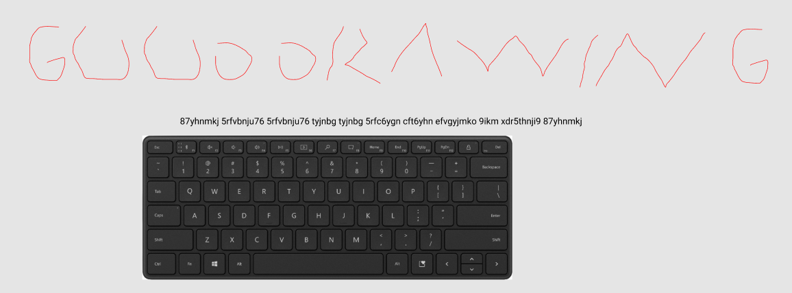

# niteCTF – Let's be Artistic

- **Category:** Misc
- **Points:** 500

## Challenge

We are given some strange strings.

## Solution

I got stuck here way too long and the hint was in the title, which implies some form of drawing needed.

The letters were really close together on the keyboard which means that the letters may have been drawn on the keyboard. Using a rough sketching software, I get the flag.



```
nite{GOODDRAWING}
```

## Thoughts

- An extremely frustrating challenge hahha, with not much clues to work from.
- Tried so many different cryptographic encryptions.
