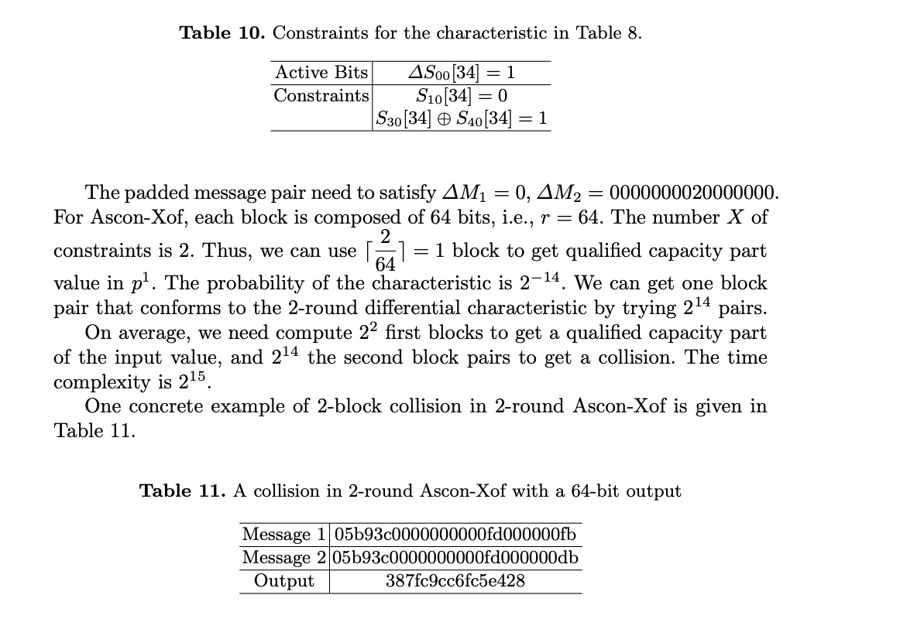

# VSCTF 2022 – Crypto Challenge

## Baby RSA (12 solves): 493 points

### Description/Source

```python
#!/usr/bin/env python3

"""
Implementation of Ascon hash function http://ascon.iaik.tugraz.at/
Round-Reduced Ascon-Hash adapted from https://github.com/meichlseder/pyascon/blob/master/ascon.py
"""

import json

FLAG = "vsctf{REDACTED}"

def ascon_xof(message):
    a = 2
    b = 2
    rate = 8 # bytes
    hashlength = 8

    # Initialization
    tagspec = int_to_bytes(0, 4)
    S = bytes_to_state(to_bytes([0, rate * 8, a, a-b]) + tagspec + zero_bytes(32))

    ascon_permutation(S, a)

    # Message Processing (Absorbing)
    m_padding = to_bytes([0x80]) + zero_bytes(rate - (len(message) % rate) - 1)
    m_padded = message + m_padding

    # first s-1 blocks
    for block in range(0, len(m_padded) - rate, rate):
        S[0] ^= bytes_to_int(m_padded[block:block+8])  # rate=8
        ascon_permutation(S, b)
    # last block
    block = len(m_padded) - rate
    S[0] ^= bytes_to_int(m_padded[block:block+8])  # rate=8

    # Finalization (Squeezing)
    H = b""
    ascon_permutation(S, a)
    while len(H) < hashlength:
        H += int_to_bytes(S[0], 8)  # rate=8
        ascon_permutation(S, b)
    return H[:hashlength]

def ascon_permutation(S, rounds=1):
    for r in range(12-rounds, 12):
        # --- add round constants ---
        S[2] ^= (0xf0 - r*0x10 + r*0x1)
        # --- substitution layer ---
        S[0] ^= S[4]
        S[4] ^= S[3]
        S[2] ^= S[1]
        T = [(S[i] ^ 0xFFFFFFFFFFFFFFFF) & S[(i+1)%5] for i in range(5)]
        for i in range(5):
            S[i] ^= T[(i+1)%5]
        S[1] ^= S[0]
        S[0] ^= S[4]
        S[3] ^= S[2]
        S[2] ^= 0XFFFFFFFFFFFFFFFF
        # --- linear diffusion layer ---
        S[0] ^= rotr(S[0], 19) ^ rotr(S[0], 28)
        S[1] ^= rotr(S[1], 61) ^ rotr(S[1], 39)
        S[2] ^= rotr(S[2],  1) ^ rotr(S[2],  6)
        S[3] ^= rotr(S[3], 10) ^ rotr(S[3], 17)
        S[4] ^= rotr(S[4],  7) ^ rotr(S[4], 41)

def zero_bytes(n):
    return n * b"\x00"

def to_bytes(l): # where l is a list or bytearray or bytes
    return bytes(bytearray(l))

def bytes_to_int(bytes):
    return sum([bi << ((len(bytes) - 1 - i)*8) for i, bi in enumerate(to_bytes(bytes))])

def bytes_to_state(bytes):
    return [bytes_to_int(bytes[8*w:8*(w+1)]) for w in range(5)]

def int_to_bytes(integer, nbytes):
    return to_bytes([(integer >> ((nbytes - 1 - i) * 8)) % 256 for i in range(nbytes)])

def rotr(val, r):
    return (val >> r) | ((val & (1<<r)-1) << (64-r))

def bytes_to_hex(b):
    return b.hex()

def print_info(data):
    maxlen = max([len(text) for (text, val) in data])
    for text, val in data:
        print("{text}:{align} 0x{val} ({length} bytes)".format(text=text, align=((maxlen - len(text)) * " "), val=bytes_to_hex(val), length=len(val)))

def collision(m1: bytes, m2: bytes) -> bool:
    return ascon_xof(m1) == ascon_xof(m2)


if __name__ == "__main__":
    print("12 rounds of Ascon is surely collision resistant. What about 2-round Ascon?")
    print("If you can find two collisions for me, I will give you the flag!\n")

    try:
        stage1 = input("1. Please send two hex encoded messages m1, m2 formatted in JSON:\n").strip()
        stage1_inp = json.loads(stage1)

        if "m1" not in stage1_inp or "m2" not in stage1_inp:
            print("Your input is missing one or more of the required fields. Please try again.")
            exit(1)

        m1 = bytes.fromhex(stage1_inp["m1"])
        m2 = bytes.fromhex(stage1_inp["m2"])

        if m1 == m2:
            print("Don't try to cheese it :(")
            exit(1)

        if b"admin" in m1 or b"admin" in m2:
            print("Too early to be an admin!")
            exit(1)

        if not collision(m1, m2):
            print("Attempt failed! Two distinct messages have distinct hashes!")
            exit(1)
        else:
            print("Nice, collision found!\n")

        stage2 = input("2. Please send another two hex encoded messages m1, m2 formatted in JSON:\n").strip()
        stage2_inp = json.loads(stage2)

        if "m1" not in stage2_inp or "m2" not in stage2_inp:
            print("Your input is missing one or more of the required fields. Please try again.")
            exit(1)

        m1 = bytes.fromhex(stage2_inp["m1"])
        m2 = bytes.fromhex(stage2_inp["m2"])

        if m1 == m2:
            print("Don't try to cheese it :(")
            exit(1)

        if b"admin" not in m1 or b"admin" not in m2:
            print("You need to be admin to get the flag!")
            exit(1)

        if not collision(m1, m2):
            print("Attempt failed! Two distinct messages have distinct hashes!")
            exit(1)
        else:
            print(f"Nice, collision found again! Here is your flag: {FLAG}")

    except Exception as e:
        print("Exception raised: ", e)
        exit(1)

```

While looking quite intimidating as the last challenge, it was actually rather straightforward and easy, no detailed source code reading was actually required.

We are supposed to provide two hash collisions, one can be any string without 'admin', and the other with.

The first collision can be just retrieved from reading the relevant [paper](https://eprint.iacr.org/2019/1115)

The next part is easy to forge, by simply following the constraint given, which is that the second block of the message has to differ by 32 (0x20).



### Solver

```python
from libnum import n2s, s2n
from pwn import *

host, port = '104.197.118.147', 10145
p = remote(host, port)

c1 = b'{"m1": "05b93c0000000000fd000000fb", "m2": "05b93c0000000000fd000000db"}'
p.sendline(c1)


# use the collision method implemented in the source
for j in range(16):
    # just try different prefix-ed blocks
    start = (s2n(b'admin') << 24) + (j) << 16
    for i in trange(2**14):
        m1 = n2s(start + i )
        m2 = n2s(start + i + 32)
        if collision(m1,m2):
            payload =str({"m1": m1.hex(), "m2": m2.hex()}).replace("'", '"').encode()
            print(payload)
            p.sendline(payload)
            p.interactive()
            p.close()
            exit()
            break
```

### Flag

```
vsctf{NIST_ROUND_5_WHENNNNNN}
```

### Notes:

The more interesting solution is an efficient implementation of the birthday attack on the hash

- from @maple3142: [https://gist.github.com/maple3142/a3442f828b02d5027ab0c96ee25cb788](https://gist.github.com/maple3142/a3442f828b02d5027ab0c96ee25cb788)
- BalsnCTF 2021 Trinity: [https://sasdf.github.io/ctf/tasks/2021/BalsnCTF/crypto/trinity/](https://sasdf.github.io/ctf/tasks/2021/BalsnCTF/crypto/trinity/)
