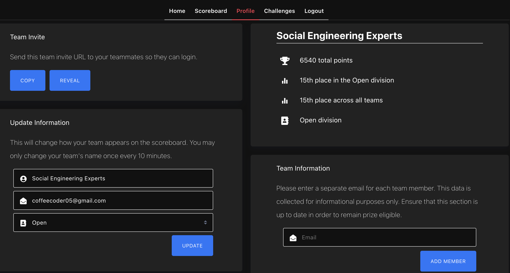

# VSCTF 2022

<em>9th - 10th July </em>

We managed to get 15th place despite only starting 10 hours before the competition ended haha. I mainly worked on the cryptography stuff.

| Challenge                      | Writeup Link                           | Tag                                               |
| ------------------------------ | -------------------------------------- | ------------------------------------------------- |
| Crypto - Baby RSA              | [here](./BabyRSA.md)                   | invalid pub exponent, nth roots of unity          |
| Crypto - Strong RSA            | [here](./strongRSA.md)                 | wilson's theorem                                  |
| Crypto - Art Final             | [here](./Art%20Final.md)               | Mersenne Twister                                  |
| Crypto - Secure Grading System | [here](./Secure%20Grading%20System.md) | Hastad's Broadcast Attack, Reused Nonces in ECDSA |
| Crypto - NIST Finalist         | [here](./NIST%20Finalist.md)           | read paper?, collision attacks                    |
